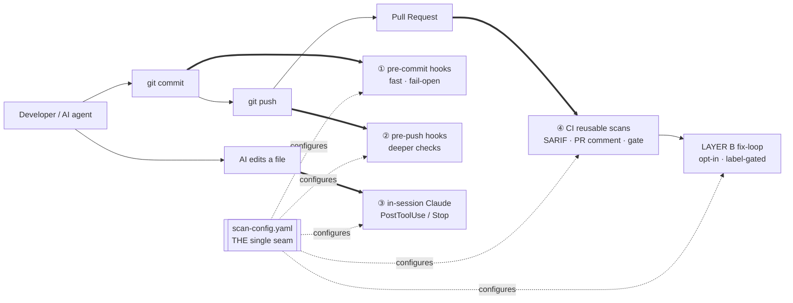
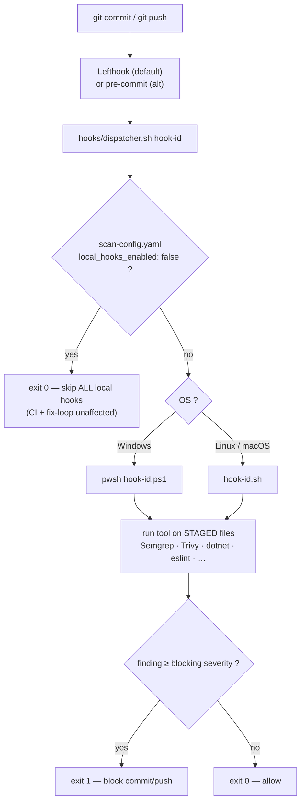
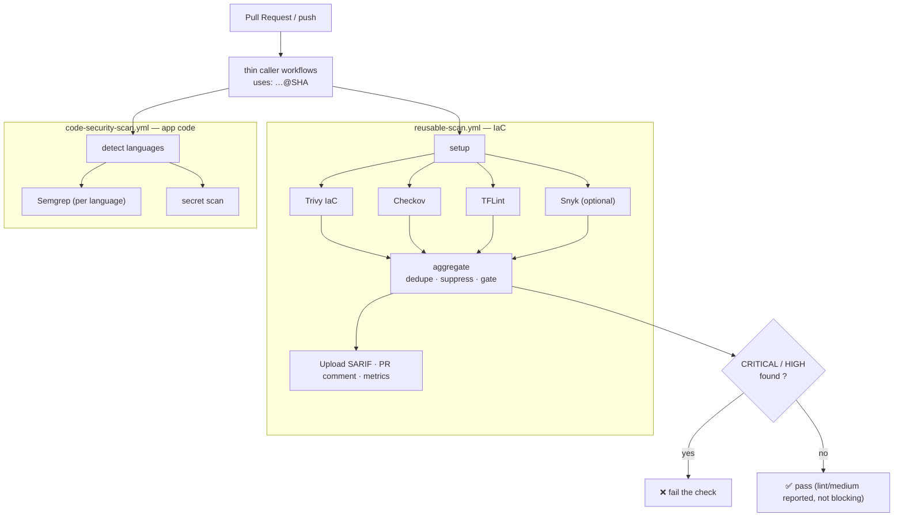
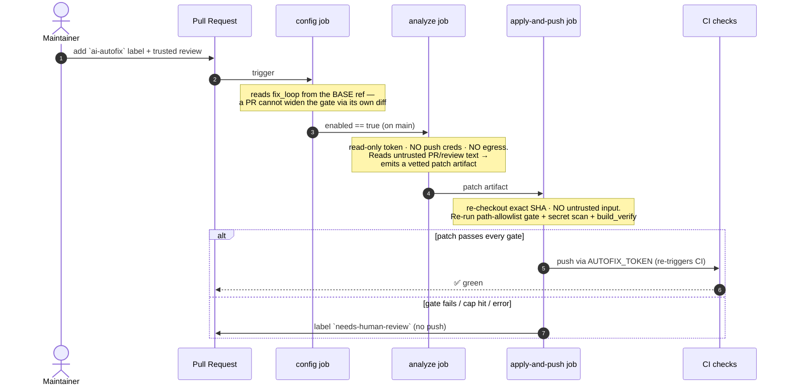
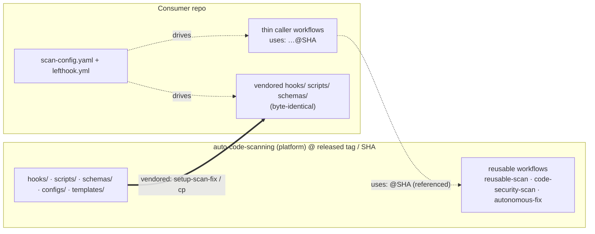

# auto-code-scanning

**A reusable, configurable scan→fix platform** for many repositories. One config file
(`scan-config.yaml`), four enforcement points, two layers — engineered to be friction-free
for **autonomous Claude Code** loops and safe for public adoption.

- **LAYER A — Scanning** (always on): Terraform/IaC **and** application code (C#/.NET,
  TypeScript/JS, SQL) via shared OS-detecting local hooks **and** reusable CI workflows.
- **LAYER B — Agentic fix-loop** (opt-in): a hardened, two-job workflow where an AI agent
  proposes a *minimal* fix and a **separate** job re-verifies and pushes it — gated by a path
  allowlist, a PR label, and SHA-pinned actions.

> Apache-2.0. Terraform scanning is fully preserved. Pin consumers to a **released tag**
> (currently `v2.0.9`) or a commit **SHA** — **never `@main`**.

---

## The big picture

One `scan-config.yaml` drives the **same checks** at four points in the lifecycle, so a finding
is caught as early (and as cheaply) as possible — and CI is the authoritative backstop.



| # | Enforcement point | When | Tool runner | Posture |
|---|---|---|---|---|
| ① | **pre-commit hooks** | every `git commit` | Lefthook → `hooks/dispatcher.sh` | fast, fail-open on infra errors |
| ② | **pre-push hooks** | every `git push` | Lefthook → `hooks/dispatcher.sh` | deeper (build, tflint, checkov) |
| ③ | **in-session Claude hooks** | each file an AI agent edits | `templates/claude/` PostToolUse/Stop | self-correct before "done" |
| ④ | **CI reusable workflows** | every PR / push | `workflow_call` (pinned `@SHA`) | authoritative, SARIF + gate |

---

## Adopt in 5 minutes (scan + fix)

```powershell
# From your repo root. Picks Lefthook (default), C#/TS scanning, and the fix-loop.
path/to/auto-code-scanning/scripts/setup-scan-fix.ps1 `
  -Languages csharp,typescript -Tier standard -EnableFixLoop
```
```bash
# Cross-platform twin:
python path/to/auto-code-scanning/scripts/setup-scan-fix.py \
  --languages csharp,typescript --tier standard --enable-fix-loop
```

One idempotent command: writes `scan-config.yaml` from a tier template, installs the
local runner + the Claude in-session bundle + thin caller workflows, creates the
`ai-autofix` / `needs-human-review` labels, **verifies** (never creates) `AUTOFIX_TOKEN`
/ `ANTHROPIC_API_KEY`, and runs verify-scanning. Terraform-only? `-Languages terraform -CloudProvider aws`.

See **[QUICK-START-5MIN](docs/QUICK-START-5MIN.md)**, **[SETUP-GUIDE](docs/SETUP-GUIDE.md)**,
and the full **[ARCHITECTURE](docs/ARCHITECTURE.md)** deep-dive.

---

## LAYER A — Scanning

**The config seam.** `scan-config.yaml` declares which languages and tools are enabled.
The same config drives the local hooks **and** CI — no logic is duplicated.

```yaml
global:
  local_hooks_enabled: true          # off-switch: false pauses ALL local hooks (CI unaffected)
  blocking_severities: [CRITICAL, HIGH]
languages:
  terraform:  { enabled: true,  tools: { trivy: {...}, checkov: {...}, tflint: {...} } }
  csharp:     { enabled: true,  build: { solution: "api/App.slnx", working_dir: "api" },
                tools: { semgrep_csharp: {...}, dotnet_format: {...}, dotnet_build: {...} } }
  typescript: { enabled: true,  tools: { eslint: {...}, prettier: {...}, semgrep_typescript: {...} } }
ci:        { sarif: { category_prefix: "scan-" } }   # distinct SARIF categories per tool
fix_loop:  { enabled: false }                        # LAYER B (see below)
```

### How a local hook runs

Both runners call the **same** `hooks/dispatcher.sh`, which checks the off-switch, then
OS-detects and execs the right per-tool implementation (`.ps1` on Windows, `.sh` on Unix).
Hooks self-discover **staged** files, so they stay fast.



| Runner | Status | Why |
|---|---|---|
| **Lefthook** | **default** | single Go binary, native Windows, parallel, no Python/cp1252 fragility → friction-free for autonomous loops |
| **pre-commit** | supported alternative | for teams standardised on pre-commit + public-ecosystem distribution |

### How CI scans run

Reusable `workflow_call` workflows emit **SARIF per tool under distinct categories**
(post-2025-07 GitHub rule), aggregate + suppress + gate, and post a PR comment.



### App-code hooks

| Hook ID | Tool | Stage |
|---|---|---|
| `semgrep-csharp` / `semgrep-typescript` | Semgrep SAST (`p/csharp` / `p/typescript`, native Windows) | pre-commit |
| `dotnet-format` | `dotnet format --verify-no-changes` (solution from config) | pre-commit |
| `dotnet-build` | Roslyn analyzers via `dotnet build` | pre-push |
| `eslint` / `prettier` | ESLint `--fix` + Prettier `--write` | pre-commit |
| `sqlfluff` | SQL lint | pre-commit |
| `validate-scan-config` | validate `scan-config.yaml` against its schema | pre-commit |

(Terraform hooks `trivy-iac-critical`, `trivy-iac-full`, `trivy-secrets`, `checkov`,
`tflint`, `gitleaks`, `snyk-iac` are unchanged — see [HOOK-REFERENCE](docs/HOOK-REFERENCE.md).)

---

## LAYER B — Agentic fix-loop (opt-in)

When enabled (`fix_loop.enabled: true` + the `ai-autofix` PR label), an AI agent proposes a
**minimal** fix and a **separate** job re-verifies and pushes it. It is engineered to be safe
on a shared workflow with write access across many repos by **splitting the dangerous
capabilities across two jobs** ("breaking the lethal trifecta"):



- **Two jobs break the "lethal trifecta"**: the `analyze` job that reads attacker-influenced
  PR text has **no write token and no egress**; the `apply-and-push` job that can push has **no
  untrusted input** and re-verifies everything.
- **Allowlist (not denylist) path gate** from `fix_loop.allowlist_paths` / `gated_paths`.
- **Activation reads the BASE ref** — a PR can't enable or widen the loop through its own diff.
- **Label opt-in + non-fork + trusted reviewer** privilege boundary.
- **claude-code-action SHA-pinned** (≥ v1.0.93, CVE-2025-66032), centralized.

Plus an **in-session layer** (`templates/claude/`): a `PostToolUse` hook scans each file the
agent edits and exits 2 to make it **self-correct in the same session**, and a `Stop` hook runs
a final scan before "done". This is what makes the loop friction-free for autonomous runs.

Read **[FIX-LOOP](docs/FIX-LOOP.md)** and **[SECURITY-MODEL](docs/SECURITY-MODEL.md)** before enabling.

---

## Consumer ↔ platform

Consumers **reference** the reusable workflows by pinned SHA and **vendor** byte-identical
copies of `hooks/` + `scripts/` + `schemas/` (so local hooks have no network dependency).
Bump one pin + re-vendor to upgrade. See **[VERSION-PINNING](docs/VERSION-PINNING.md)**.



---

## Adoption tiers

| Tier | Blocks | App-code | Fix-loop |
|---|---|---|---|
| **starter** | CRITICAL | formatters + secrets | off |
| **standard** (recommended) | CRITICAL, HIGH | + SAST (Semgrep) | wired, off |
| **strict** | CRITICAL, HIGH, MEDIUM | + Roslyn build, full pre-push | **on** (still needs label) |

`templates/scan-config/{starter,standard,strict}.yaml`.

## Documentation

- **Understand it:** **[ARCHITECTURE](docs/ARCHITECTURE.md)** (diagrams + component deep-dive) · [SECURITY-MODEL](docs/SECURITY-MODEL.md)
- **Adopt in a new repo:** **[Consumer Repo Setup Guide](docs/consumer-repo-setup-guide.md)** · [QUICK-START-5MIN](docs/QUICK-START-5MIN.md) · [SETUP-GUIDE](docs/SETUP-GUIDE.md) · [AI-AGENT-GUIDE](docs/AI-AGENT-GUIDE.md)
- **Scanning:** [APP-CODE-SCANNING](docs/APP-CODE-SCANNING.md) · [HOOK-REFERENCE](docs/HOOK-REFERENCE.md) · [MULTI-CLOUD](docs/MULTI-CLOUD.md) · [LOCAL-HOOKS-TOGGLE](docs/LOCAL-HOOKS-TOGGLE.md)
- **Fix-loop:** [FIX-LOOP](docs/FIX-LOOP.md) · [SECURITY-MODEL](docs/SECURITY-MODEL.md)
- **Adoption:** [ADOPTION-PLAYBOOK](docs/ADOPTION-PLAYBOOK.md) · [VERSION-PINNING](docs/VERSION-PINNING.md) · [TESTING-GUIDE-CONSUMING-REPO](docs/TESTING-GUIDE-CONSUMING-REPO.md) · [CONSUMER-MIGRATION](docs/CONSUMER-MIGRATION.md)
- **Reference:** [TROUBLESHOOTING](docs/TROUBLESHOOTING.md) · [SEVERITY-MAPPING](docs/SEVERITY-MAPPING.md) · [SUPPRESSION-GOVERNANCE](docs/SUPPRESSION-GOVERNANCE.md) · [ROADMAP](docs/ROADMAP.md) · [CHANGELOG](CHANGELOG.md)

## Repository structure

```
auto-code-scanning/
├── scan-config.yaml                # THE seam: languages + tools + fix_loop
├── schemas/scan-config.schema.json # config contract (hook + CI validation)
├── .pre-commit-hooks.yaml          # pre-commit manifest (alternative runner)
├── hooks/                          # dispatcher.sh + per-tool .sh/.ps1 + lib/common.{sh,ps1}
├── .github/workflows/
│   ├── reusable-scan.yml           # IaC scan (workflow_call)
│   ├── code-security-scan.yml      # app-code scan, distinct SARIF categories
│   └── autonomous-fix.yml          # two-job agentic fix-loop (workflow_call)
├── templates/
│   ├── scan-config/                # tier configs (starter/standard/strict)
│   ├── lefthook/                   # default local runner
│   ├── claude/                     # in-session bundle (.claude settings + hooks)
│   ├── fix-loop/                   # thin fix caller (privilege boundary)
│   └── workflows/                  # thin scan callers
├── scripts/                        # setup-scan-fix, scan-and-fix, check-fix-allowlist, …
├── configs/                        # cloud-specific IaC tool configs (aws/azure/gcp/common)
├── tests/                          # fixtures + python + integration tests
└── docs/                           # documentation (start with ARCHITECTURE.md)
```
