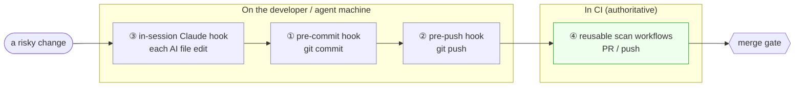
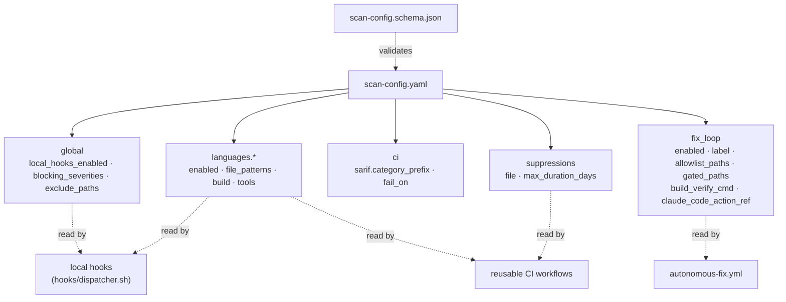
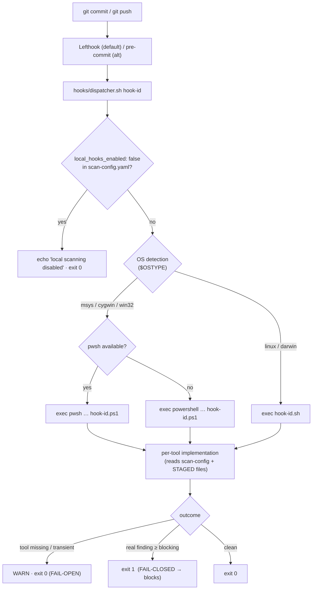
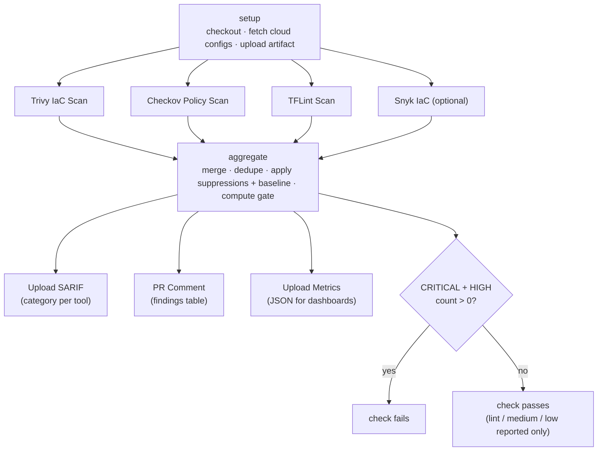
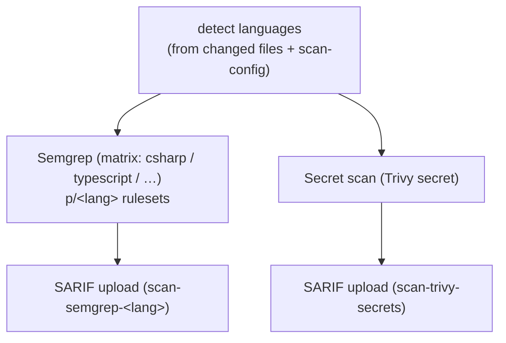
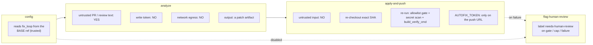
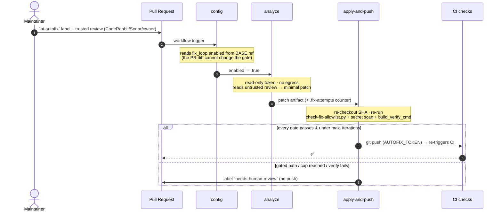
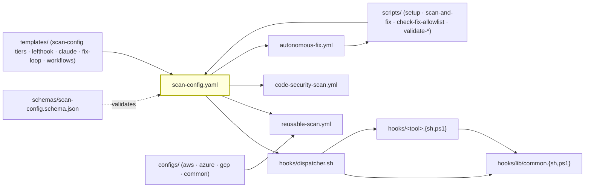

# Architecture

How `auto-code-scanning` is put together, why it is shaped this way, and how the pieces fit.
If you are new to the project, read this top-to-bottom; the [README](../README.md) is the
2‑minute version.

---

## 1. Design goals

1. **One source of truth.** A single `scan-config.yaml` decides *what* runs. Local hooks and
   CI read the **same** config — there is no second place to keep in sync.
2. **Shift left, but trust CI.** Catch a finding at the earliest cheap point (a pre-commit
   hook), but treat **CI as the authoritative gate** — local hooks are an optimization, never
   the only line of defense.
3. **Friction-free for autonomous agents.** Native Windows, no Python/`cp1252` fragility in
   the hot path, fail-open on infra errors, and an in-session feedback loop so an AI agent
   self-corrects before it ever opens a PR.
4. **Safe to share with write access.** The fix-loop can push to many repos, so its dangerous
   capabilities are split across jobs and gated by an allowlist, a label, and SHA-pinned actions.
5. **Versioned product, thin consumers.** Consumers keep one config file + thin pinned callers
   and a vendored copy of the hooks; upgrading is a pin bump + re-vendor.

---

## 2. Defense in depth — the same check, four times

The core idea: a misconfiguration or secret should be caught **as early as possible**, and if
it slips past one layer the next one still catches it. All four layers are driven by the same
`scan-config.yaml`.



| Layer | Trigger | Speed | If it misses |
|---|---|---|---|
| ③ in-session Claude | each AI edit | ms–s | the agent never even commits it |
| ① pre-commit | `git commit` | ~5s typical | caught at push |
| ② pre-push | `git push` | ~15–120s | caught in CI |
| ④ CI | PR / push | minutes | **blocks merge** (the backstop) |

---

## 3. The seam: `scan-config.yaml`

Everything keys off one file, validated against `schemas/scan-config.schema.json` (by a
hook *and* in CI). It is the only thing a consumer must understand.



Key fields:

- **`global.local_hooks_enabled`** — the off-switch. `false` makes every local hook exit 0
  (CI and the fix-loop are unaffected). See [LOCAL-HOOKS-TOGGLE](LOCAL-HOOKS-TOGGLE.md).
- **`global.blocking_severities`** — which severities fail a commit / CI check (others are
  reported but non-blocking).
- **`languages.<lang>.build`** — e.g. the .NET `solution` + `working_dir` so the dotnet hooks
  know what to format/build. Resolved **relative to `working_dir`**.
- **`fix_loop.*`** — drives LAYER B (see §6).

---

## 4. LAYER A (local) — how a hook actually runs

Local enforcement is **runner-agnostic**: Lefthook (default) or pre-commit both invoke the
same `hooks/dispatcher.sh <hook-id>`. The dispatcher is the single brain.



Design notes:

- **Fail-open vs fail-closed.** Infra problems (a tool not installed, a transient 5xx) must
  **never** block a developer → the hook warns and exits 0. A *real finding* fails closed.
  This distinction is enforced consistently across the `.sh` and `.ps1` twins.
- **Staged-file discovery is NUL-safe.** Changed files are enumerated with `git … -z` and read
  into arrays (`mapfile -d ''` / NUL split), so paths with spaces or newlines are never merged
  or skipped. (Capturing `-z` output into a plain `$(...)` scalar silently drops the NUL
  delimiters — a bug the hooks deliberately avoid.)
- **`.sh` ↔ `.ps1` parity.** Every hook has both implementations; `hooks/lib/common.{sh,ps1}`
  holds the shared helpers (changed-dir detection, staged export, severity mapping, logging).

See [HOOK-REFERENCE](HOOK-REFERENCE.md) for every hook ID and [APP-CODE-SCANNING](APP-CODE-SCANNING.md)
for the language hooks.

---

## 5. LAYER A (CI) — reusable scan workflows

Two reusable `workflow_call` workflows do the authoritative scanning. Consumers add **thin
callers** that just `uses:` them at a pinned SHA.

### IaC — `reusable-scan.yml`



### App code — `code-security-scan.yml`



Why distinct SARIF **categories** (`category_prefix`, e.g. `scan-trivy-iac`,
`scan-semgrep-csharp`): since 2025-07 GitHub rejects multiple SARIF uploads that share a
category — each tool must land in its own lane, or later uploads overwrite earlier ones.

**Suppressions & baseline** (`suppressions.file`, default `.scan-suppressions.yaml`): the
aggregate step filters known/accepted findings with an expiry, so the gate reflects *new*
risk. See [SUPPRESSION-GOVERNANCE](SUPPRESSION-GOVERNANCE.md) and [SEVERITY-MAPPING](SEVERITY-MAPPING.md).

---

## 6. LAYER B — the agentic fix-loop

The fix-loop runs on a **shared** workflow that holds write access to many repos. The threat
model is: *untrusted PR/review text must never reach a job that can push or exfiltrate.* The
classic "lethal trifecta" (untrusted input + secrets/write + egress) is broken by splitting it
across jobs.

### Per-job capabilities



### Sequence



### The gates that make it safe

| Control | Mechanism |
|---|---|
| **Opt-in** | `fix_loop.enabled: true` **and** the `ai-autofix` label |
| **Base-ref activation** | `config` reads `fix_loop` from `base.sha`, never the PR head — a PR can't enable/widen the loop via its own diff |
| **Trust boundary** | non-fork + owner check + trusted reviewer list (CodeRabbit / SonarCloud / OWNER·MEMBER·COLLABORATOR) |
| **Path allowlist** | `scripts/check-fix-allowlist.py` — only `allowlist_paths`, never `gated_paths` (auth/payment/crypto/`.github`/…); fails **closed** on malformed config |
| **Re-verification** | `apply-and-push` re-runs the allowlist gate + secret scan + `build_verify_cmd` on the exact SHA before pushing |
| **Iteration cap** | `max_iterations` via a `.fix-attempts` counter → then `needs-human-review` |
| **Pinned action** | `claude_code_action_ref` SHA-pinned (≥ v1.0.93, CVE-2025-66032) |
| **Token scope** | `AUTOFIX_TOKEN` is injected **only** into the final push URL, never written to disk in `analyze` |

Full write-up: [FIX-LOOP](FIX-LOOP.md) · [SECURITY-MODEL](SECURITY-MODEL.md).

### In-session layer (what makes it converge)

`templates/claude/` ships a `.claude` bundle:

- **`PostToolUse` hook** — after the agent edits a file, scan just that file; on a finding the
  hook **exits 2**, which feeds the error back to the agent so it **self-corrects in the same
  session** (before any commit).
- **`Stop` hook** — a final `scan-and-fix` pass before the agent declares "done".

This is why the loop is friction-free: most issues are fixed in-session and never reach CI.

---

## 7. Consumer integration & versioning

```mermaid
flowchart TD
    subgraph platform["auto-code-scanning @ vX.Y.Z (immutable SHA)"]
        rw["reusable workflows"]
        files["hooks/ · scripts/ · schemas/ · configs/ · templates/"]
        tag["git tag vX.Y.Z == commit SHA"]
    end
    subgraph consumer["Consumer repo"]
        call["thin callers (uses: …@SHA # vX.Y.Z)"]
        vend["vendored hooks/ scripts/ schemas/"]
        owncfg["scan-config.yaml + lefthook.yml"]
    end
    rw -. "referenced by SHA" .-> call
    files == "vendored (byte-identical)" ==> vend
    owncfg --> call
    owncfg --> vend

    note["Upgrade = bump the pin SHA + re-vendor the 3 dirs.<br/>Never use @main; a tag is immutable only by convention —<br/>pin the SHA the tag points to."]
```

- **Referenced, not vendored:** the reusable workflows (`uses: …@<SHA>`). The caller's
  top-level `permissions:` is the **ceiling** for the reusable jobs, so it must be the union of
  what they need (`contents:read, actions:read, issues:write, pull-requests:write`).
- **Vendored, byte-identical:** `hooks/`, `scripts/`, `schemas/` (local hooks must work with no
  network). Re-vendor on every pin bump so the local code matches the referenced workflows.
- **Pin by SHA, comment the tag** (`@<sha> # v2.0.9`). See [VERSION-PINNING](VERSION-PINNING.md).

---

## 8. Component map



| Path | Role |
|---|---|
| `scan-config.yaml` | the seam — declares languages, tools, gates, fix-loop |
| `schemas/scan-config.schema.json` | config contract; validated by a hook and in CI |
| `hooks/dispatcher.sh` | off-switch + OS-detect + dispatch to per-tool impl |
| `hooks/lib/common.{sh,ps1}` | shared helpers (staged files, dirs, severity, logging) |
| `hooks/<tool>.{sh,ps1}` | one pair per tool (Trivy, Checkov, TFLint, Semgrep, dotnet, eslint, …) |
| `.github/workflows/reusable-scan.yml` | reusable IaC scan (`workflow_call`) |
| `.github/workflows/code-security-scan.yml` | reusable app-code scan (`workflow_call`) |
| `.github/workflows/autonomous-fix.yml` | two-job fix-loop (`workflow_call`) |
| `scripts/` | `setup-scan-fix`, `scan-and-fix`, `check-fix-allowlist`, `validate-scan-config`, … |
| `templates/` | tier configs, lefthook config, the `.claude` bundle, thin callers |
| `configs/` | cloud-specific IaC tool configs (`aws` / `azure` / `gcp` / `common`) |

---

## 9. Failure modes (fail-open vs fail-closed)

A quick reference for "what happens when X breaks":

| Situation | Behavior | Rationale |
|---|---|---|
| A scan tool isn't installed locally | hook **warns, exits 0** | infra ≠ a finding; don't block devs |
| A tool download 5xx / rate-limits in CI | retry with backoff (e.g. tflint `--init` + `GITHUB_TOKEN`) | transient, not a code problem |
| A *real* finding ≥ blocking severity | **exit 1 / fail the check** | that's the whole point |
| `scan-config.yaml` malformed | `validate-scan-config` **fails closed** | a broken gate is worse than a slow one |
| Fix-loop fed a malformed/over-broad patch | path gate **fails closed** → `needs-human-review` | never auto-push outside the allowlist |
| `local_hooks_enabled: false` | all local hooks **skip (exit 0)** | deliberate pause; CI still enforces |

---

## See also

- [SECURITY-MODEL](SECURITY-MODEL.md) — the fix-loop threat model in full
- [FIX-LOOP](FIX-LOOP.md) — operating the loop
- [HOOK-REFERENCE](HOOK-REFERENCE.md) — every hook ID
- [APP-CODE-SCANNING](APP-CODE-SCANNING.md) · [MULTI-CLOUD](MULTI-CLOUD.md)
- [VERSION-PINNING](VERSION-PINNING.md) · [CONSUMER-MIGRATION](CONSUMER-MIGRATION.md)
- [CHANGELOG](../CHANGELOG.md)
