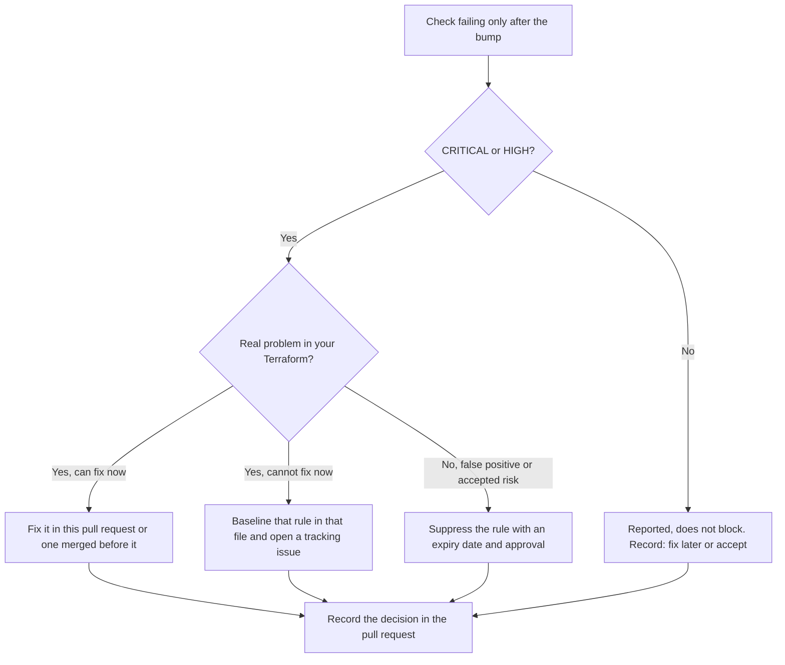

# Runbook: Bump the Scan

Move a repository's Terraform scan caller to a new release of this platform, and record
what changes in its results.

The current release is `v2.2.0`. <!-- x-release-please-version -->

Line references such as `reusable-scan.yml:44` mean that line of
`.github/workflows/reusable-scan.yml` at commit
[`7cd34a5`](https://github.com/agenticcodingops/auto-code-scanning/tree/7cd34a52c823a725575ef3b59ab34e062d1d83dd)
on `main`.

## Purpose

A release can change scanner versions, configs and rules, so the same Terraform can
produce different results. This runbook moves the two pins together, records the failed
checks before and after, and makes someone decide what to do about each new one before
the change merges.

## When to use

- A new release of this platform is published and you want it.
- Your caller still pins a release before `v2.1.0`. Read
  [Upgrading from a release before 2.1.0](VERSION-PINNING.md#upgrading-from-a-release-before-210)
  first.
- Dependabot opened a pull request that changes the `uses:` line of your scan caller.
  Dependabot updates `uses:` references to reusable workflows
  ([GitHub Docs: Keeping your actions up to date with Dependabot][gh-dependabot]). Nothing
  in those docs covers workflow inputs, so move `scanning-repo-ref` yourself (step 4).

## Prerequisites

- A caller workflow for `reusable-scan.yml`, such as the one in
  [TERRAFORM-MODULE-ADOPTION.md](TERRAFORM-MODULE-ADOPTION.md). This runbook calls it
  `terraform-scan.yml`.
- The caller runs on `pull_request`, `push` to the default branch and
  `workflow_dispatch`, like the template (`templates/workflows/terraform-scan.yml:7-12`).
- Your owner's copy, `OWNER/auto-code-scanning`, holds the target release. The scan reads
  its configs from that copy (`reusable-scan.yml:126`; see
  [REUSABLE-WORKFLOWS.md](REUSABLE-WORKFLOWS.md#configs-come-from-your-owners-copy)).
- `gh` (GitHub CLI), authenticated as someone who can run the repository's workflows and
  download their artifacts, and `jq`.
- A second maintainer to review the pull request.

Roles: the **Operator** is the maintainer doing the bump. The **Reviewer** approves the
pull request. **CI** is GitHub Actions.

## Steps

### 1. Read what changed

- **Who:** Operator
- **Operator STOP:** no

Read the `CHANGELOG.md` entries between your current pin and the target release. Note
every changed scanner version, config and rule. The scanner versions of the current
release are in
[VERSION-PINNING.md](VERSION-PINNING.md#scanner-versions-in-the-terraform-scan).

### 2. Find the commit of the target release

- **Who:** Operator
- **Operator STOP:** no

Pin the commit the release tag points to, as described in
[VERSION-PINNING.md](VERSION-PINNING.md#pin-the-commit-a-release-tag-points-to):

```bash
git ls-remote https://github.com/OWNER/auto-code-scanning 'refs/tags/vX.Y.Z*'
```

An annotated tag lists two lines; use the commit on the line ending in `^{}`. Check the
same commit exists in your owner's copy.

### 3. Record the failed checks before the bump

- **Who:** Operator
- **Operator STOP:** no

Run the scan on the default branch at the current pin, then save its findings. The
`aggregated-results` artifact is kept for one day only (`reusable-scan.yml:789-795`), so
download it soon after the run.

```bash
BRANCH="$(gh repo view --json defaultBranchRef --jq .defaultBranchRef.name)"
git fetch origin "$BRANCH"
gh workflow run terraform-scan.yml --ref "$BRANCH"
# List the dispatched runs for the branch's current commit; use the one created just now.
gh run list --workflow terraform-scan.yml --event workflow_dispatch \
  --commit "$(git rev-parse "origin/$BRANCH")" --limit 5 --json databaseId,createdAt,status
gh run watch <run-id>
gh run download <run-id> --name aggregated-results --dir before
jq -r '.findings[] | select((.suppressed or .baseline) | not)
       | [.severity, .tool, .rule_id, .file] | @tsv' before/aggregated.json \
  | sort -u > before.tsv
```

`aggregated.json` lists every finding with `suppressed` and `baseline` flags
(`reusable-scan.yml:597-686`, `758-768`); the filter keeps the active ones. Save the run's
job summaries too: they name the Trivy, TFLint and ruleset versions
(`reusable-scan.yml:189-201`, `371-383`).

Trivy secret findings are not in `aggregated.json` (`reusable-scan.yml:561-568`,
`597-615`). Note the open alerts in the `trivy-secrets` code scanning category instead.

### 4. Move both pins in one commit

- **Who:** Operator
- **Operator STOP:** no

On a new branch, change the `uses:` commit and `scanning-repo-ref` together, in the same
commit:

```yaml
jobs:
  terraform-scan:
    uses: OWNER/auto-code-scanning/.github/workflows/reusable-scan.yml@<commit-sha> # vX.Y.Z
    with:
      scanning-repo-ref: <commit-sha>
```

The `uses:` ref selects the workflow. `scanning-repo-ref` selects the configs it scans
with (`reusable-scan.yml:123-131`). If they differ, the run uses one release's workflow
with another release's configs. Never leave `scanning-repo-ref` unset: its default,
`v1.0.0`, is not a tag in this repository (`reusable-scan.yml:40-44`).

Find every other pin to this platform and move it in the same pull request:

```bash
grep -rnE 'auto-code-scanning|scanning-repo-ref|scanning_repo(_ref)?:' .github/workflows
grep -n -A1 'auto-code-scanning' .pre-commit-config.yaml 2>/dev/null   # the rev: line follows
```

That includes `scanning_repo_ref` in an `autonomous-fix.yml` caller
(`autonomous-fix.yml:51-55`) and a pre-commit `rev:`.

### 5. Open the pull request

- **Who:** Operator, then CI
- **Operator STOP:** no

Push the branch and open a pull request. CI runs the scan with the new pins.

### 6. Record the failed checks after the bump

- **Who:** Operator
- **Operator STOP:** no

Take the scan run of the pull request, and compare it with the run from step 3:

```bash
# The pull request run for the commit you pushed in step 5.
gh run list --workflow terraform-scan.yml --event pull_request \
  --commit "$(git rev-parse HEAD)" --limit 5 --json databaseId,createdAt,status
gh run download <run-id> --name aggregated-results --dir after
jq -r '.findings[] | select((.suppressed or .baseline) | not)
       | [.severity, .tool, .rule_id, .file] | @tsv' after/aggregated.json \
  | sort -u > after.tsv
comm -13 before.tsv after.tsv > new.tsv     # failing only after the bump
comm -23 before.tsv after.tsv > gone.tsv    # failing only before the bump
```

Paste `new.tsv` and `gone.tsv` into the pull request description, with the scanner
versions from both runs' job summaries. Compare the `trivy-secrets` alerts too.

### 7. Decide how each newly failing check is handled

- **Who:** Operator and Reviewer
- **Operator STOP:** yes. Do not merge until every line of `new.tsv` has a recorded
  decision.

Only CRITICAL and HIGH findings fail the scan, and only while the caller's
`fail-on-findings` input is `true`, its default (`reusable-scan.yml:45-49`, `752-756`).
Check the value in your caller. Checkov
findings are normally MEDIUM; a TFLint rule at `error` level is HIGH
(`reusable-scan.yml:624-628`, `646`; see
[REUSABLE-WORKFLOWS.md](REUSABLE-WORKFLOWS.md#the-gate-counts-critical-and-high-only)).



How each option works in the scan:

| Option | Effect | Source |
|---|---|---|
| Fix the Terraform | The finding disappears from the next run. | none |
| Baseline | Hides that rule in that one file. Add an entry whose `hash` is the SHA-256 of `<rule_id>\|<file>` to `.scan-baseline/baseline.json`. | `reusable-scan.yml:724-735` |
| Suppress | Hides that rule for that tool in **every** file, until `expires_date`. Add it to `.scan-suppressions.yaml`; HIGH and CRITICAL need security approval under [SUPPRESSION-GOVERNANCE.md](SUPPRESSION-GOVERNANCE.md). | `reusable-scan.yml:688-719`; `configs/common/.scan-suppressions.yaml:8-30` |

Prefer a fix, then a baseline, then a suppression: a suppression is the widest.

### 8. Review and merge

- **Who:** Reviewer, then Operator
- **Operator STOP:** no

The Reviewer checks that both pins name the same commit and that every new failing check
has a decision. The Operator merges. CI runs the scan on the default branch.

## Verify

- The pull request run used the new versions: its Trivy and TFLint job summaries, and
  the Checkov banner in its log, match the versions in the target release's
  `CHANGELOG.md` entry. For the current release they are also listed in
  [VERSION-PINNING.md](VERSION-PINNING.md#scanner-versions-in-the-terraform-scan).
- The Setup Scanning Tools, Trivy IaC Scan, Checkov Policy Scan, TFLint Scan and Aggregate
  Results jobs all passed. Aggregate runs even when a scan job fails
  (`reusable-scan.yml:514`), so check every job.
- The `checkov-results` artifact contains `checkov-results.json`. Before `v2.1.0`, Checkov
  wrote no report (`CHANGELOG.md:23-25`).
- The first run on the default branch after the merge passed.

## Rollback

- **Who:** Operator, with Reviewer approval

1. Revert the bump commit in a new pull request: `git revert <bump-commit>`. Both pins
   move back together.
2. Remove any baseline or suppression entries you added only for the new release.
3. Let CI run the scan on the pull request, check it matches `before.tsv`, and merge.

## References

- [VERSION-PINNING.md](VERSION-PINNING.md): pinning rules and scanner versions.
- [REUSABLE-WORKFLOWS.md](REUSABLE-WORKFLOWS.md): inputs, outputs and behaviour of
  `reusable-scan.yml`.
- [SUPPRESSION-GOVERNANCE.md](SUPPRESSION-GOVERNANCE.md): approval and expiry of
  suppressions.
- `CHANGELOG.md`: what each release changed.
- [GitHub Docs: Keeping your actions up to date with Dependabot][gh-dependabot]

[gh-dependabot]: https://docs.github.com/en/code-security/dependabot/working-with-dependabot/keeping-your-actions-up-to-date-with-dependabot
