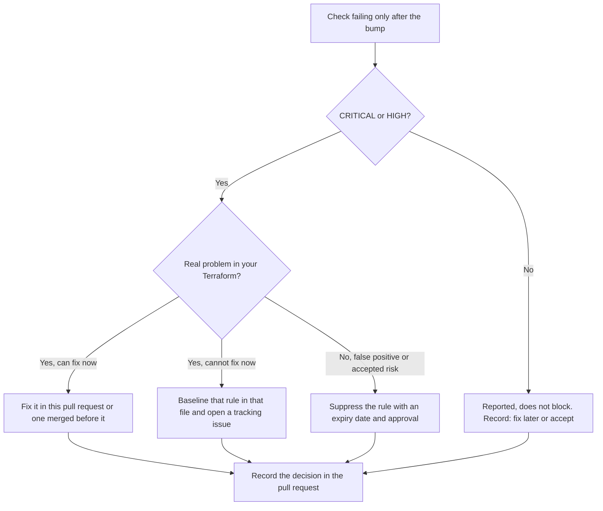

# Runbook: Bump the Scan

Move a repository's Terraform scan caller to a new release of this platform, and record
what changes in its results.

The current release is `v2.3.2`. <!-- x-release-please-version -->

Every `file:line` reference on this page, such as `reusable-scan.yml:44`, means that line
at commit
[`7cd34a5`](https://github.com/agenticcodingops/auto-code-scanning/tree/7cd34a52c823a725575ef3b59ab34e062d1d83dd)
on `main`. Workflow file names such as `reusable-scan.yml` and `autonomous-fix.yml` are
under `.github/workflows/`; other paths are relative to the repository root.

## Purpose

A release can change scanner versions, configs and rules, so the same Terraform can
produce different results. This runbook moves the two pins together, records the failed
checks before and after, and makes someone decide what to do about each new one before
the change merges.

## When to use

- A new release of this platform is published and you want it.
- Your caller still pins a release before `v2.1.0`. Read
  [Upgrading from a release before 2.1.0](VERSION-PINNING.md#upgrading-from-a-release-before-210)
  first.
- Dependabot opened a pull request that changes the `uses:` line of your scan caller.
  Dependabot updates `uses:` references to reusable workflows
  ([GitHub Docs: Keeping your actions up to date with Dependabot][gh-dependabot]). Nothing
  in those docs covers workflow inputs, so move `scanning-repo-ref` yourself (step 4).

## Prerequisites

- A caller workflow for `reusable-scan.yml`, such as the one in
  [TERRAFORM-MODULE-ADOPTION.md](TERRAFORM-MODULE-ADOPTION.md). This runbook calls it
  `terraform-scan.yml`.
- The caller runs on `pull_request`, `push` to the default branch and
  `workflow_dispatch`, like the template (`templates/workflows/terraform-scan.yml:7-12`).
- Your owner's copy, `OWNER/auto-code-scanning`, holds the target release. The scan reads
  its configs from that copy (`reusable-scan.yml:126`; see
  [REUSABLE-WORKFLOWS.md](REUSABLE-WORKFLOWS.md#configs-come-from-your-owners-copy)).
- `gh` (GitHub CLI), authenticated as someone who can run the repository's workflows and
  download their artifacts, and `jq`.
- A second maintainer to review the pull request.

Roles: the **Operator** is the maintainer doing the bump. The **Reviewer** approves the
pull request. **CI** is GitHub Actions.

## Steps

### 1. Read what changed

- **Who:** Operator
- **Operator STOP:** no

In a clone of this platform, list what the scan installs and reads between your current
pin and the target release, and note every changed scanner version, config and rule:

```bash
git fetch --tags origin
git diff <current-pin> vX.Y.Z -- .github/workflows/reusable-scan.yml configs/
```

`CHANGELOG.md` is not enough: release-please leaves out `ci:`, `chore:` and `build:`
commits (`release-please-config.json:12-18`), and scanner pins have been changed under
`ci(scan):`.

For a target of `v2.2.0` or later, the tag's Release Verification run
(`release-verify.yml`) logs the Checkov, Trivy and TFLint versions and the azurerm
ruleset. The aws and google ruleset versions are the `plugin` blocks in
`configs/<cloud>/.tflint.hcl` at the target commit (step 2). The scanner versions of the
current release are also in
[VERSION-PINNING.md](VERSION-PINNING.md#scanner-versions-in-the-terraform-scan).

### 2. Find the commit of the target release

- **Who:** Operator
- **Operator STOP:** no

Pin the commit the release tag points to, as described in
[VERSION-PINNING.md](VERSION-PINNING.md#pin-the-commit-a-release-tag-points-to):

```bash
git ls-remote https://github.com/OWNER/auto-code-scanning 'refs/tags/vX.Y.Z*'
```

An annotated tag lists two lines; use the commit on the line ending in `^{}`. Check the
same commit exists in your owner's copy.

### 3. Record the failed checks before the bump

- **Who:** Operator
- **Operator STOP:** no

Run the scan on the default branch at the current pin, then save its findings. The
`aggregated-results` artifact is kept for one day only (`reusable-scan.yml:789-795`), so
download it soon after the run.

```bash
BRANCH="$(gh repo view --json defaultBranchRef --jq .defaultBranchRef.name)"
git fetch origin "$BRANCH"
gh workflow run terraform-scan.yml --ref "$BRANCH"
# List the dispatched runs for the branch's current commit; use the one created just now.
gh run list --workflow terraform-scan.yml --event workflow_dispatch \
  --commit "$(git rev-parse "origin/$BRANCH")" --limit 5 --json databaseId,createdAt,status
gh run watch <run-id>
gh run download <run-id> --name aggregated-results --dir before
# LC_ALL=C sorts by byte, so step 6 can compare this file from any shell.
jq -r '.findings[] | select((.suppressed or .baseline) | not)
       | [.severity, .tool, .rule_id, .file] | @tsv' before/aggregated.json \
  | LC_ALL=C sort -u > before.tsv
```

`aggregated.json` lists every finding with `suppressed` and `baseline` flags
(`reusable-scan.yml:597-686`, `758-768`); the filter keeps the active ones. Save the run's
job summaries too: they name the Trivy, TFLint and ruleset versions
(`reusable-scan.yml:189-201`, `371-383`).

Trivy secret findings are not in `aggregated.json` (`reusable-scan.yml:561-568`,
`597-615`). Note the open alerts in the `trivy-secrets` code scanning category instead.

### 4. Move both pins in one commit

- **Who:** Operator
- **Operator STOP:** no

On a new branch, change the `uses:` commit and `scanning-repo-ref` together, in the same
commit:

```yaml
jobs:
  terraform-scan:
    uses: OWNER/auto-code-scanning/.github/workflows/reusable-scan.yml@<commit-sha> # vX.Y.Z
    with:
      scanning-repo-ref: <commit-sha>
```

The `uses:` ref selects the workflow. `scanning-repo-ref` selects the configs it scans
with (`reusable-scan.yml:123-131`). If they differ, the run uses one release's workflow
with another release's configs. Never leave `scanning-repo-ref` unset: its default,
`v1.0.0`, is not a tag in this repository (`reusable-scan.yml:40-44`).

Find every other pin to this platform and move it in the same pull request:

```bash
grep -rnE 'auto-code-scanning|scanning-repo-ref|scanning_repo(_ref)?:' .github/workflows
grep -n -A1 'auto-code-scanning' .pre-commit-config.yaml 2>/dev/null   # the rev: line follows
```

That includes `scanning_repo_ref` in an `autonomous-fix.yml` caller
(`autonomous-fix.yml:51-55`) and a pre-commit `rev:`.

If an `autonomous-fix.yml` caller is among the pins, compare
`.github/workflows/autonomous-fix.yml`, `scripts/check-fix-allowlist.py` and
`templates/fix-loop/autonomous-fix.yml` between the old and the new commit. For example,
run `git diff <old-sha> <new-sha> -- <those paths>` in a clone of your owner's copy, or
use GitHub's compare view. If any of them changed, check each job's `permissions:`
against the grants on your caller's job, because a called workflow cannot raise them. Have
the Reviewer read that diff in step 8. After the merge, repeat the fix-loop checks in
[CONSUMER-MIGRATION.md](CONSUMER-MIGRATION.md#verify). If you would rather not review the
fix loop in a scan bump, move its pins in a separate pull request and do these checks
there.

### 5. Open the pull request

- **Who:** Operator, then CI
- **Operator STOP:** no

Push the branch and open a pull request. CI runs the scan with the new pins.

### 6. Record the failed checks after the bump

- **Who:** Operator
- **Operator STOP:** no

Take the scan run of the pull request, and compare it with the run from step 3:

```bash
# The pull request run for the commit you pushed in step 5.
gh run list --workflow terraform-scan.yml --event pull_request \
  --commit "$(git rev-parse HEAD)" --limit 5 --json databaseId,createdAt,status
gh run watch <run-id>   # the artifact is uploaded even when the gate fails
gh run download <run-id> --name aggregated-results --dir after
jq -r '.findings[] | select((.suppressed or .baseline) | not)
       | [.severity, .tool, .rule_id, .file] | @tsv' after/aggregated.json \
  | LC_ALL=C sort -u > after.tsv
LC_ALL=C comm -13 before.tsv after.tsv > new.tsv     # failing only after the bump
LC_ALL=C comm -23 before.tsv after.tsv > gone.tsv    # failing only before the bump
```

`comm` needs both files sorted in the collation it runs under, so keep `LC_ALL=C` on every
`sort` and `comm`. If you made `before.tsv` without it, re-sort it first with
`LC_ALL=C sort -u -o before.tsv before.tsv`. If `comm` prints "not in sorted order", do
not use its output. Download the artifact within a day of the run: it is kept for one day.

Paste `new.tsv` and `gone.tsv` into the pull request description, with the scanner
versions from both runs' job summaries. Compare the `trivy-secrets` alerts too.

### 7. Decide how each newly failing check is handled

- **Who:** Operator and Reviewer
- **Operator STOP:** yes. Do not merge until every line of `new.tsv` has a recorded
  decision and every line of `gone.tsv` has a recorded reason.

Only CRITICAL and HIGH findings fail the scan, and only while the caller's
`fail-on-findings` input is `true`, its default (`reusable-scan.yml:45-49`, `752-756`).
Check the value in your caller. Checkov
findings are normally MEDIUM; a TFLint rule at `error` level is HIGH
(`reusable-scan.yml:624-628`, `646`; see
[REUSABLE-WORKFLOWS.md](REUSABLE-WORKFLOWS.md#the-gate-counts-critical-and-high-only)).



How each option works in the scan:

| Option | Effect | Source |
|---|---|---|
| Fix the Terraform | The finding disappears from the next run. | none |
| Baseline | Hides that rule in that one file. Add an entry whose `hash` is the SHA-256 of `<rule_id>\|<file>` to `.scan-baseline/baseline.json`; the format is below. | `reusable-scan.yml:724-735` |
| Suppress | Hides that rule for that tool in **every** file, until `expires_date`. Add it to `.scan-suppressions.yaml`; HIGH and CRITICAL need security approval under [SUPPRESSION-GOVERNANCE.md](SUPPRESSION-GOVERNANCE.md). Quote the date; see below. | `reusable-scan.yml:688-719`; `configs/common/.scan-suppressions.yaml:8-30` |

Prefer a fix, then a baseline, then a suppression: a suppression is the widest.

**Baseline format.** `.scan-baseline/baseline.json` must be a JSON object with an
`entries` array, and each entry needs a `hash`. Start a new file as `{"entries": []}`. A
top-level array makes the Aggregate step crash. An entry without `hash` makes it ignore
the whole file (`reusable-scan.yml:724-735`). The hash is the lowercase hex SHA-256 of
`<rule_id>|<file>` with no trailing newline. Copy both values exactly from the `rule_id`
and `file` columns of `new.tsv`, because Checkov paths there start with `/`:

```bash
printf '%s|%s' '<rule_id>' '<file>' | sha256sum | cut -d' ' -f1
```

**Suppression format.** Quote the date (`expires_date: "YYYY-MM-DD"`). Set `tool:` on
every entry to the scanner exactly as the `tool` column of `new.tsv` shows it (`trivy`,
`checkov`, `tflint` or `snyk`). The scan matches on `rule_id` and `tool` only and ignores
the section name. Up to v2.3.0, one unquoted date made the scan drop every suppression in
the file without a message (`reusable-scan.yml:695-719`). Later releases skip only that
entry, with a workflow warning in the Aggregate Results job's log, so read that log after a
bump. `scripts/validate-suppressions.py` still passes such a file, so a clean validation
does not prove the scan applies it. For `snyk`
entries use `hooks/validate-suppressions.py`: `scripts/validate-suppressions.py` rejects the
`snyk` tool with V-004 (`scripts/validate-suppressions.py:58`), although the scan reads
`snyk_suppressions`. Check the
**Suppressions applied** count in the next run's pull request comment, or
`suppressions_applied` in `aggregated.json`. See
[REUSABLE-WORKFLOWS.md](REUSABLE-WORKFLOWS.md#suppressions-and-baseline).

**Approval.** A baseline never expires, and the scan never checks who approved it
(`reusable-scan.yml:724-735`). For a real CRITICAL or HIGH problem you cannot fix now,
first get the approval that
[SUPPRESSION-GOVERNANCE.md](SUPPRESSION-GOVERNANCE.md#by-severity) requires for a
suppression of that severity. Give the tracking issue a review date no later than that
severity's maximum duration (HIGH three months, CRITICAL one month). Remove the baseline
entry when the issue closes.

### 8. Review and merge

- **Who:** Reviewer, then Operator
- **Operator STOP:** no

The Reviewer checks that both pins name the same commit, that every new failing check
has a decision and that every line of `gone.tsv` has a reason. The Operator merges. CI
runs the scan on the default branch.

## Verify

- The pull request run used the new versions: its Trivy and TFLint job summaries, and
  the Checkov banner in its log, match the scanner versions pinned at the target release.
  Those versions are listed in
  [VERSION-PINNING.md](VERSION-PINNING.md#scanner-versions-in-the-terraform-scan) at that
  release, and recorded by the target tag's Release Verification run (the Trivy and
  TFLint job summaries, and the Checkov banner in its log). That run covers the azurerm
  ruleset only: for your cloud's TFLint ruleset, read `configs/<cloud>/.tflint.hcl` at the
  target commit. For `v2.1.0`, its `CHANGELOG.md` entry lists them. Later entries are
  generated from commit subjects, so they name a scanner version only when a commit
  subject does.
- The Setup Scanning Tools, Trivy IaC Scan, Checkov Policy Scan, TFLint Scan and Aggregate
  Results jobs all passed. Aggregate runs even when a scan job fails
  (`reusable-scan.yml:514`), so check every job.
- The `checkov-results` artifact contains `checkov-results.json`. Before `v2.1.0`, Checkov
  wrote no report (the 2.1.0 entry of `CHANGELOG.md`).
- The Trivy and TFLint reports are usable. The scan jobs stay green when a scanner fails
  (`reusable-scan.yml:187`, `442`). The artifacts are kept for one day
  (`reusable-scan.yml:251`, `450`). Use the pull request run from step 6:

  ```bash
  gh run download <run-id> --name trivy-results --dir after-trivy
  jq -e 'has("SchemaVersion")' after-trivy/trivy-iac-results.json >/dev/null
  jq -e 'has("SchemaVersion")' after-trivy/trivy-secrets-results.json >/dev/null   # check it, never print it
  gh run download <run-id> --name tflint-results --dir after-tflint
  jq -e '(.errors | length) == 0' after-tflint/tflint-results.json >/dev/null
  ```

  These are the checks the platform's self-test makes
  (`reusable-scan-self-test.yml:91-119`). To run them on every pull request, add a job
  like it to your caller (see
  [REUSABLE-WORKFLOWS.md](REUSABLE-WORKFLOWS.md#a-green-job-does-not-prove-its-scanner-ran)).
- If every finding of one tool moved to `gone.tsv`, treat that scanner as broken until its
  log and report show it ran and Aggregate read its findings.
- The first run on the default branch after the merge passed.

## Rollback

- **Who:** Operator, with Reviewer approval

1. On a new branch, move every pin you changed in step 4 back to the previous commit:
   `uses:`, `scanning-repo-ref`, any `autonomous-fix.yml` caller's `uses:` and
   `scanning_repo_ref`, and a pre-commit `rev:`. Either `git revert` the original pin
   commits (still in your clone, or fetch them with `git fetch origin pull/<N>/head`) or
   edit the pins by hand. Revert the squash commit, or use the pull request's Revert
   button, only if the bump pull request changed nothing but pins: both also undo the
   Terraform fixes and baseline entries made in step 7.
2. Remove any baseline or suppression entries you added only for the new release.
3. Check that the pull request run used the previous release's versions (job summaries
   and the Checkov banner). Its failed checks need not match `before.tsv`: Terraform
   merged since the bump, including the step 7 fixes, changes them. Record any
   difference.
4. The Reviewer approves; the Operator merges.

## References

- [VERSION-PINNING.md](VERSION-PINNING.md): pinning rules and scanner versions.
- [REUSABLE-WORKFLOWS.md](REUSABLE-WORKFLOWS.md): inputs, outputs and behaviour of
  `reusable-scan.yml`.
- [SUPPRESSION-GOVERNANCE.md](SUPPRESSION-GOVERNANCE.md): approval and expiry of
  suppressions.
- `CHANGELOG.md`: what each release changed.
- [GitHub Docs: Keeping your actions up to date with Dependabot][gh-dependabot]

[gh-dependabot]: https://docs.github.com/en/code-security/dependabot/working-with-dependabot/keeping-your-actions-up-to-date-with-dependabot
