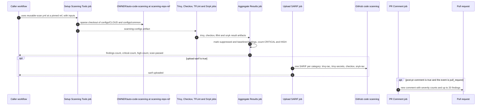

# Reusable Workflows

This page lists every input, output, secret and permission of the three reusable
workflows that an adopting repository calls. Use it when you write or review a caller
workflow.

The current release is `v2.2.0`. <!-- x-release-please-version -->

Every `file:line` reference on this page, such as `reusable-scan.yml:26`, means that line
at commit
[`7cd34a5`](https://github.com/agenticcodingops/auto-code-scanning/tree/7cd34a52c823a725575ef3b59ab34e062d1d83dd)
on `main`. Workflow file names such as `reusable-scan.yml` and `autonomous-fix.yml` are
under `.github/workflows/`; other paths are relative to the repository root.

## Choose a workflow

| Workflow | What it does | Caller template | Source |
|---|---|---|---|
| `reusable-scan.yml` | Scans Terraform with Trivy (misconfigurations and secrets), Checkov, TFLint and, optionally, Snyk IaC. Gates on CRITICAL and HIGH findings, uploads SARIF and comments on the pull request. | `templates/workflows/terraform-scan.yml` | `reusable-scan.yml:5-6`, `160-503` |
| `code-security-scan.yml` | Scans C# and TypeScript with Semgrep, and the whole checkout with a Trivy secret scan. Uploads SARIF. | `templates/workflows/code-security-scan.yml` | `code-security-scan.yml:5-7`, `126-250` |
| `autonomous-fix.yml` | Proposes a minimal fix to an opted-in pull request in one job. Another job re-checks it with the path gate, a Trivy secret scan of the changed files and the optional build command, then pushes it. It runs no IaC or code scan of its own. | `templates/fix-loop/autonomous-fix.yml` | `autonomous-fix.yml:9-21`, `381-423` |

For a worked Terraform example, see [TERRAFORM-MODULE-ADOPTION.md](TERRAFORM-MODULE-ADOPTION.md).

## How a Terraform scan runs

The diagram shows one call of `reusable-scan.yml`, from the caller to the SARIF upload
and the pull request comment.

Sources: setup job `reusable-scan.yml:113-155`; scan jobs `160-503`; Aggregate
`509-795`; Upload SARIF `801-922`; PR Comment `928-1015`; workflow outputs `80-95`.
`OWNER` is the owner of the calling repository (see
[Configs come from your owner's copy](#configs-come-from-your-owners-copy)).

## Before you call any of them

### Pin the call

- Pin `uses:` to a release tag or a full commit SHA. Never use `@main`. See
  [VERSION-PINNING.md](VERSION-PINNING.md).
- The `uses:` ref selects the workflow file only. `reusable-scan.yml` checks out its
  configs from the `scanning-repo-ref` input (`reusable-scan.yml:123-131`), and
  `autonomous-fix.yml` checks out its scripts from `scanning_repo_ref`
  (`autonomous-fix.yml:204-210`, `356-362`). Set that input to the same tag or commit as
  `uses:`.
- To move to a new release, follow [BUMP-THE-SCAN.md](BUMP-THE-SCAN.md).

### Grant permissions on the calling job

A called workflow can keep or reduce the `GITHUB_TOKEN` permissions it receives. It
cannot raise them ([GitHub Docs: Reusing workflow configurations][gh-reuse]). If a job in
the called workflow asks for more than the calling job grants, GitHub rejects the call.
This repository's own callers grant the permissions even for jobs they switch off
(`reusable-scan-self-test.yml:45-50`). Each section below lists what to grant.

### Concurrency

`reusable-scan.yml` and `code-security-scan.yml` both set
`group: ${{ github.workflow }}-${{ github.ref }}` with `cancel-in-progress: true`
(`reusable-scan.yml:104-106`, `code-security-scan.yml:69-71`). In a called workflow, the
`github` context is the caller's ([GitHub Docs: Reusing workflow configurations][gh-reuse]).
So:

- Two calls from the same caller workflow on the same ref compute the same group. With
  `cancel-in-progress: true`, a new run in a group cancels the one in progress
  ([GitHub Docs: Control the concurrency of workflows and jobs][gh-concurrency]). This
  includes a `strategy.matrix` over one call. Put each call in its own caller workflow
  file, with its own `name:`.
- Do not give the caller workflow the group `${{ github.workflow }}-${{ github.ref }}`.
  It equals the called workflow's group, and GitHub cancels the run as a concurrency
  deadlock (`release-verify.yml:18-24`).

`autonomous-fix.yml` uses the group `autonomous-fix-<pr_number>` and never cancels a run
in progress (`autonomous-fix.yml:72-74`).

## `reusable-scan.yml`

Terraform and IaC scan. Called through `workflow_call` (`reusable-scan.yml:23-24`).

### Inputs

| Input | Type | Required | Default | What it does | Source |
|---|---|---|---|---|---|
| `terraform-directory` | string | no | `.` | Directory to scan. Trivy's misconfiguration scan and Snyk scan it. Checkov scans it too, but skips any path that contains `examples` or `tests` (`skip-path` in `configs/<cloud>/.checkov.yaml`). TFLint runs once in every directory under it that holds a `.tf` file. | `reusable-scan.yml:26-30`, `180`, `209`, `274`, `389-403`, `477`, `488`; `configs/azure/.checkov.yaml:52-58` |
| `cloud-provider` | string | yes | none | `aws`, `azure` or `gcp`. Selects `configs/<cloud>/` for Checkov, TFLint and the policy overlay, and names the metrics artifact. Any other value fails the setup job: there is no `configs/<value>/.checkov.yaml` to copy. | `reusable-scan.yml:31-34`, `130`, `141-143`, `1074` |
| `severity` | string | no | `CRITICAL,HIGH` | Severity filter for Trivy's misconfiguration scan only. The Trivy secret scan always uses `HIGH,CRITICAL`. Checkov and TFLint do not read it. The gate counts CRITICAL and HIGH whatever you set. | `reusable-scan.yml:35-39`, `181`, `210`, `223`, `236`, `752-756` |
| `scanning-repo-ref` | string | no | `v1.0.0` | Tag, branch or SHA of `OWNER/auto-code-scanning` to read the configs from. **Always set it**, to the same tag or commit as `uses:`. This repository has no `v1.0.0` tag or branch (checked with `git ls-remote` on 2026-10-03). If your copy has none either, the default fails the setup job. | `reusable-scan.yml:40-44`, `123-131` |
| `fail-on-findings` | boolean | no | `true` | When `true`, the Aggregate Results job fails if a CRITICAL or HIGH finding remains after suppressions and the baseline. When `false`, findings never fail it. | `reusable-scan.yml:45-49`, `536`, `751-756`, `785-786` |
| `upload-sarif` | boolean | no | `true` | Runs the Upload SARIF job. | `reusable-scan.yml:50-54`, `809` |
| `post-pr-comment` | boolean | no | `true` | Runs the PR Comment job. It runs only on `pull_request` events and posts a new comment on every run. | `reusable-scan.yml:55-59`, `936`, `1010-1015` |
| `apply-suppressions` | boolean | no | `true` | Marks findings listed in `.scan-suppressions.yaml`, at the caller's repository root, as suppressed. See [Suppressions and baseline](#suppressions-and-baseline). | `reusable-scan.yml:60-64`, `534`, `688-719` |
| `apply-baseline` | boolean | no | `true` | Marks findings listed in `.scan-baseline/baseline.json` as baselined. | `reusable-scan.yml:65-69`, `535`, `721-735` |
| `enable-snyk` | boolean | no | `false` | Runs the Snyk IaC job. Needs the `SNYK_TOKEN` secret. The job installs the `snyk` package from npm without a version pin. | `reusable-scan.yml:70-74`, `461`, `471-472` |
| `upload-metrics` | boolean | no | `true` | Uploads the artifact `scan-metrics-<cloud-provider>-<run_id>`, kept for 90 days. | `reusable-scan.yml:75-79`, `1026`, `1071-1076` |

### Outputs

| Output | Value | Source |
|---|---|---|
| `findings-count` | Number of active findings, of every severity. Active means neither suppressed nor baselined. Trivy secret findings are not included. | `reusable-scan.yml:81-83`, `738`, `747`, `772` |
| `critical-count` | Number of active CRITICAL findings. | `reusable-scan.yml:84-86`, `748`, `773` |
| `high-count` | Number of active HIGH findings. | `reusable-scan.yml:87-89`, `749`, `774` |
| `scan-passed` | `true` when no active CRITICAL or HIGH finding remains, or when `fail-on-findings` is `false`. Otherwise `false`. | `reusable-scan.yml:90-92`, `751-756`, `775` |
| `sarif-uploaded` | `true` when at least one of the four SARIF uploads succeeded, otherwise `false`. Empty when `upload-sarif` is `false`, because the job does not run. | `reusable-scan.yml:93-95`, `809`, `911-922` |

### Secrets

| Secret | Required | What it is for | Source |
|---|---|---|---|
| `SNYK_TOKEN` | no | Snyk API token. Used only when `enable-snyk` is `true`. | `reusable-scan.yml:96-99`, `476`, `487` |

### Permissions to grant on the calling job

| Permission | Needed by | Source |
|---|---|---|
| `contents: read` | every job | `reusable-scan.yml:101-102` |
| `security-events: write` | Upload SARIF | `reusable-scan.yml:805-807` |
| `pull-requests: write` | PR Comment | `reusable-scan.yml:932-934` |

Grant all three even when you turn the SARIF or comment job off
(`reusable-scan-self-test.yml:45-50`).

### What a run produces

- **Code scanning categories:** `trivy-iac`, `trivy-secrets`, `checkov` and `snyk-iac`
  (`reusable-scan.yml:881`, `890`, `899`, `908`). No input changes them. For one commit,
  a later upload with the same tool and category overwrites the earlier results, and two
  such uploads in one workflow run fail it ([GitHub Docs: Uploading a SARIF file to
  GitHub][gh-sarif]). So two calls of this workflow on the same commit, for example one
  per cloud, keep only one call's results in code scanning. TFLint results are not
  uploaded to code scanning. When a SARIF file is over 25 MB or holds more than 5,000
  results, each run in it keeps its 5,000 most severe results and then gets one
  `scan-truncation-warning` result, so a run can hold 5,001 results and a file with
  several runs can hold more (`reusable-scan.yml:825-872`).
- **Pull request comment:** counts per severity, the number suppressed and baselined,
  and up to 20 active findings (`reusable-scan.yml:956-1008`). The table is not sorted
  most severe first. Its sort maps CRITICAL to `0` and then applies `|| 4`, so CRITICAL
  findings sort after LOW (`reusable-scan.yml:970-973`). When 20 or more active findings
  are HIGH, MEDIUM or LOW, no CRITICAL finding appears in the table. Use the CRITICAL
  count above the table, or `aggregated.json`.
- **Artifacts kept for 1 day:** `scanning-configs`, `trivy-results`, `checkov-results`,
  `tflint-results`, `snyk-results` (when Snyk runs) and `aggregated-results`
  (`reusable-scan.yml:147-155`, `241-251`, `314-322`, `444-450`, `495-503`, `789-795`).
  `aggregated-results` holds `aggregated.json`, which lists every finding with its
  `tool`, `rule_id`, `severity`, `file`, `suppressed` and `baseline` fields
  (`reusable-scan.yml:597-686`, `758-768`).
- **Job summaries:** the Trivy version and the digest of its checks bundle
  (`reusable-scan.yml:189-201`), and the TFLint version with each ruleset version
  (`reusable-scan.yml:371-383`).

### Behaviour to know

#### Configs come from your owner's copy

The setup job checks out `${{ github.repository_owner }}/auto-code-scanning`
(`reusable-scan.yml:126`). That is a repository named `auto-code-scanning` under the
owner of the **calling** repository, not the repository in your `uses:` line. Your owner
needs a copy with that name, and the copy must hold the ref you pass as
`scanning-repo-ref`.

The checkout passes no token, so `actions/checkout` uses its default,
`${{ github.token }}`: the caller run's `GITHUB_TOKEN` (`reusable-scan.yml:123-131`). That token can only read the repository that runs the
workflow ([GitHub Docs: GITHUB_TOKEN][gh-token]). A public copy works. A private copy
does not. Whether an internal copy works is UNKNOWN.

#### The gate counts CRITICAL and HIGH only

With `fail-on-findings: true`, the default, active CRITICAL and HIGH findings fail the
Aggregate Results job. MEDIUM and LOW findings are reported in the comment and SARIF, but
never fail it (`reusable-scan.yml:45-49`, `752-756`). How each tool's severity is mapped:

| Tool | Severity used | Source |
|---|---|---|
| Trivy | Trivy's own severity. | `reusable-scan.yml:604` |
| Checkov | The report's `severity`, or MEDIUM when it has none. Open-source Checkov reports no severity without a platform API key (the 2.1.0 entry of `CHANGELOG.md`), so Checkov findings are normally MEDIUM and do not block. | `reusable-scan.yml:624-628` |
| TFLint | Rule severity `error` becomes HIGH, `warning` MEDIUM, `notice` LOW. A TFLint rule at `error` level counts toward the gate. | `reusable-scan.yml:646`, `653` |
| Snyk | `critical`, `high`, `medium`, `low` map to the same level. | `reusable-scan.yml:667`, `675` |

#### Trivy secret findings are not counted

The Aggregate step loads `trivy-secrets-results.json` but builds findings from the
misconfiguration report only (`reusable-scan.yml:561-568`, `597-615`). Secret findings
reach code scanning under `trivy-secrets` when `upload-sarif` is `true`. They do not
change the outputs, the gate or the comment. The secret scan step does not fail its job
either (`continue-on-error: true`, `reusable-scan.yml:217-227`). For a secret gate, use
`code-security-scan.yml` with `run-secret-scan: true`.

#### A green job does not prove its scanner ran

Aggregate Results runs even when a scan job failed (`if: always()`,
`reusable-scan.yml:514`), and skips any report it cannot find or parse
(`reusable-scan.yml:552-595`). Make the setup and scan jobs required status checks too,
not only Aggregate Results: that catches a job that fails, such as a failed
`tflint --init` (`reusable-scan.yml:359-369`).

It does not catch a scanner that wrote no report. The Trivy, Checkov and TFLint scan steps
have `continue-on-error: true` (`reusable-scan.yml:187`, `227`, `281`, `442`), and the
result uploads keep `upload-artifact`'s default `if-no-files-found: warn`
(`reusable-scan.yml:241-251`, `314-322`, `444-450`). So, for example, the Checkov job can
pass with no `checkov-results.json`, and every required check stays green without a
Checkov scan. To fail on a missing report, add a job to your caller like the `verify` job
of `reusable-scan-self-test.yml` (lines 61-136). It downloads the run's artifacts and fails
when the Checkov or Trivy report is missing or TFLint reported an error.

#### Checkov uses this repository's config

Checkov reads `configs/<cloud>/.checkov.yaml` from the configs checkout, not a
`.checkov.yaml` in your repository (`reusable-scan.yml:141`, `275`; the 2.1.0 entry of
`CHANGELOG.md`).

#### Suppressions and baseline

- **Suppressions.** The step reads `.scan-suppressions.yaml` at the repository root, in
  the sections `trivy_suppressions`, `checkov_suppressions`, `tflint_suppressions` and
  `snyk_suppressions` (`reusable-scan.yml:691`, `699`). An entry counts only while its
  `expires_date` (`YYYY-MM-DD`) is today or later; an entry with no `expires_date` is
  ignored (`reusable-scan.yml:701-709`). Quote the date, for example
  `expires_date: "2026-12-31"`. PyYAML reads an unquoted `2026-12-31` as a date object.
  `strptime` then raises `TypeError`, which the `except ValueError` at
  `reusable-scan.yml:708` does not catch, and the `except Exception` at
  `reusable-scan.yml:718-719` swallows it. So one such entry, in any section, stops every
  suppression in the file from being applied, and no error is shown. The same happens
  with any other non-string value, such as a full timestamp. The local
  `validate-suppressions` hook accepts the unquoted form
  (`hooks/validate-suppressions.py:89-90`), so it does not warn you. It matches on
  `rule_id` and `tool` only, so it suppresses that rule in every file; `tool` must be
  `trivy`, `checkov`, `tflint` or `snyk` (`reusable-scan.yml:706`, `712`). The workflow
  does not read `file_pattern`. If PyYAML cannot be imported or the file cannot be
  parsed, no suppression is applied and no error is shown (`reusable-scan.yml:692-719`).
  Whether the runner image provides PyYAML is UNKNOWN from this repository. For the
  approval rules, see [SUPPRESSION-GOVERNANCE.md](SUPPRESSION-GOVERNANCE.md).
- **Baseline.** The step reads `.scan-baseline/baseline.json`. A finding is baselined
  when the SHA-256 of `<rule_id>|<file>` is one of its `entries[].hash` values
  (`reusable-scan.yml:724-735`). `scripts/create-baseline.ps1` writes that file in that
  format (`create-baseline.ps1:49`, `97-107`, `240`). Whether the file paths it records
  locally match the paths in a CI run is UNKNOWN; compare one entry with
  `aggregated.json` before you rely on it.

## `code-security-scan.yml`

Application-code scan. Called through `workflow_call` (`code-security-scan.yml:23-24`).
For the scan-config side, see [APP-CODE-SCANNING.md](APP-CODE-SCANNING.md).

### Inputs

| Input | Type | Required | Default | What it does | Source |
|---|---|---|---|---|---|
| `languages` | string | no | `""` | Comma-separated: `csharp`, `typescript`. Other values are dropped. When empty, the workflow reads `scan-config.yaml` at the caller's repository root and scans each of those two languages whose `languages.<name>.enabled` is `true`. If it cannot read that file, it logs a warning and scans no language. | `code-security-scan.yml:26-30`, `96-115` |
| `severity` | string | no | `ERROR` | Passed to `semgrep --severity`. Give one level: `INFO`, `WARNING` or `ERROR`. Semgrep reports rules of exactly that level; it is not a minimum. Semgrep 1.100.0 rejects a comma-separated value such as `ERROR,WARNING` with exit code 2 (tested locally): the SARIF step then writes an empty report and the gate step fails. | `code-security-scan.yml:31-35`, `169-179`, `195-200` |
| `category-prefix` | string | no | `scan-` | Prefix of the SARIF categories `<prefix>semgrep-<language>` and `<prefix>trivy-secrets`. An empty value becomes `scan-`. When `languages` is empty and `scan-config.yaml` sets `ci.sarif.category_prefix`, that value replaces this input. | `code-security-scan.yml:36-40`, `97`, `111-113`, `186`, `242` |
| `semgrep-version` | string | no | `1.100.0` | Semgrep version installed with pip. | `code-security-scan.yml:41-45`, `147-151` |
| `run-secret-scan` | boolean | no | `true` | Runs the Secret scan job: Trivy 0.71.0, secret scanner, CRITICAL and HIGH, over the whole checkout except `node_modules`, `dist`, `build`, `bin`, `obj` and `.terraform`. | `code-security-scan.yml:46-50`, `210`, `223-235` |
| `fail-on-findings` | boolean | no | `true` | Adds a gate step to each job. The Semgrep gate fails on any finding at `severity`. The secret gate fails on any CRITICAL or HIGH secret. | `code-security-scan.yml:51-55`, `189-200`, `245-250` |
| `upload-sarif` | boolean | no | `true` | Uploads each job's SARIF to code scanning. An upload error does not fail the job. | `code-security-scan.yml:56-60`, `181-187`, `237-243` |

Semgrep uses the registry rulesets `p/csharp` and `p/typescript`. No input changes them
(`code-security-scan.yml:153-162`).

### Outputs

| Output | Value | Source |
|---|---|---|
| `languages-scanned` | JSON array of the languages scanned, for example `["csharp", "typescript"]`, or `[]`. | `code-security-scan.yml:61-64`, `82`, `116-118` |

### Secrets

None. The `workflow_call` block declares no secrets (`code-security-scan.yml:23-64`).

### Permissions to grant on the calling job

| Permission | Needed by | Source |
|---|---|---|
| `contents: read` | every job | `code-security-scan.yml:66-67` |
| `security-events: write` | Semgrep and Secret scan jobs | `code-security-scan.yml:132-134`, `211-213` |

No job asks for `pull-requests`. The workflow posts no pull request comment and uploads no
artifact.

## `autonomous-fix.yml`

Opt-in fix loop. Called through `workflow_call` (`autonomous-fix.yml:34-35`). Read
[FIX-LOOP.md](FIX-LOOP.md) and [SECURITY-MODEL.md](SECURITY-MODEL.md) before you turn it
on. The caller workflow decides who can start it; the template's `if:` is that boundary
(`templates/fix-loop/autonomous-fix.yml:36-53`).

### Inputs

| Input | Type | Required | Default | What it does | Source |
|---|---|---|---|---|---|
| `pr_number` | string | yes | none | Pull request to fix. Must be digits only. A pull request from a fork is refused. | `autonomous-fix.yml:37-40`, `182-190` |
| `config_path` | string | no | `scan-config.yaml` | Path of the config in your repository. It is read from the pull request's base commit, or from the default branch on `workflow_dispatch`, never from the pull request head. The jobs after the config job run only when its `fix_loop.enabled` is `true`. | `autonomous-fix.yml:41-45`, `92-142`, `160` |
| `scanning_repo` | string | no | `agenticcodingops/auto-code-scanning` | Repository to check out the shared scripts from; the path gate runs `scripts/check-fix-allowlist.py` from it. Set it when you call your own copy. | `autonomous-fix.yml:46-50`, `204-210`, `313`, `356-362`, `385` |
| `scanning_repo_ref` | string | no | `v2.0.0` | Ref of `scanning_repo` to check out. Set it to the same tag or commit as `uses:`. | `autonomous-fix.yml:51-55`, `208`, `360` |

### Outputs

None. The `workflow_call` block declares no outputs (`autonomous-fix.yml:34-65`).

### Secrets

| Secret | Required | What it is for | Source |
|---|---|---|---|
| `AUTOFIX_TOKEN` | yes | Used only by the final push step. Its description asks for a fine-grained token with Contents and Pull requests read and write, on your repository only. | `autonomous-fix.yml:57-59`, `446-456` |
| `ANTHROPIC_API_KEY` | no | Key for the coding-agent step. | `autonomous-fix.yml:60-62`, `244` |
| `CLAUDE_CODE_OAUTH_TOKEN` | no | Alternative to `ANTHROPIC_API_KEY`. | `autonomous-fix.yml:63-65`, `245` |

The workflow does not require either agent credential. The agent step has
`continue-on-error: true` (`autonomous-fix.yml:280`). Without a credential it produces no
patch, so the run ends with no change and does not label the pull request
(`autonomous-fix.yml:282-300`, `338-341`, `466-473`).

### Permissions to grant on the calling job

| Permission | Needed by | Source |
|---|---|---|
| `contents: read` | every job | `autonomous-fix.yml:69-70`, `162`, `343` |
| `pull-requests: write` | Analyze (`read`) and Flag for human review (`write`) | `autonomous-fix.yml:163`, `476` |
| `actions: read` | Analyze | `autonomous-fix.yml:164` |
| `issues: write` | Flag for human review | `autonomous-fix.yml:475` |

The caller template sets only `contents: read`, at the workflow level, and no job-level
permissions (`templates/fix-loop/autonomous-fix.yml:32-33`). Add the four permissions
above to its `fix` job.

## References

- [VERSION-PINNING.md](VERSION-PINNING.md): how to pin, and the scanner versions.
- [BUMP-THE-SCAN.md](BUMP-THE-SCAN.md): move a caller to a new release.
- [TERRAFORM-MODULE-ADOPTION.md](TERRAFORM-MODULE-ADOPTION.md): a complete Terraform
  caller.
- [CONSUMER-MIGRATION.md](CONSUMER-MIGRATION.md): replace inline workflows with callers.
- [GitHub Docs: Reusing workflow configurations][gh-reuse]
- [GitHub Docs: GITHUB_TOKEN][gh-token]
- [GitHub Docs: Control the concurrency of workflows and jobs][gh-concurrency]
- [GitHub Docs: Uploading a SARIF file to GitHub][gh-sarif]

[gh-reuse]: https://docs.github.com/en/actions/reference/workflows-and-actions/reusing-workflow-configurations
[gh-token]: https://docs.github.com/en/actions/concepts/security/github_token
[gh-concurrency]: https://docs.github.com/en/actions/how-tos/write-workflows/choose-when-workflows-run/control-workflow-concurrency
[gh-sarif]: https://docs.github.com/en/code-security/code-scanning/integrating-with-code-scanning/uploading-a-sarif-file-to-github
