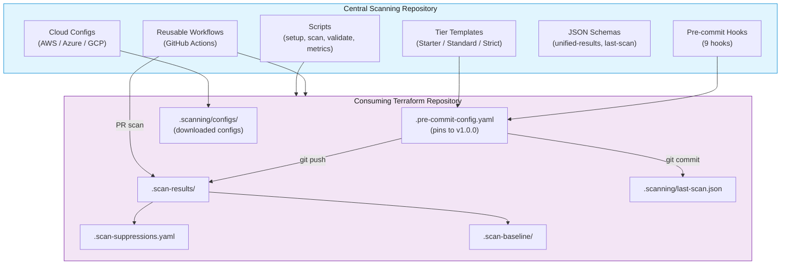
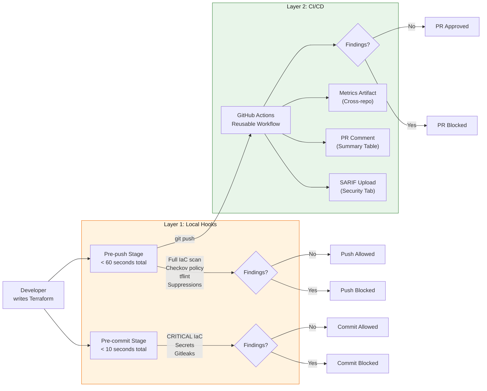
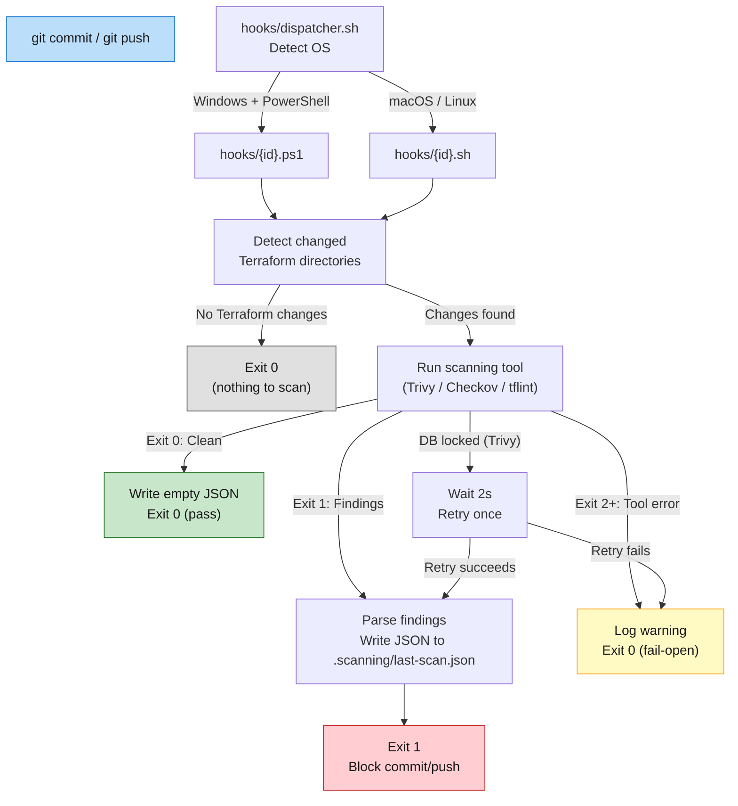
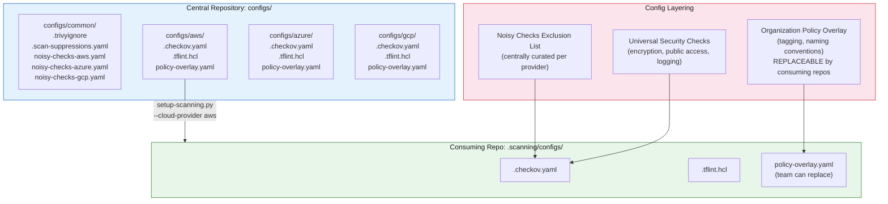
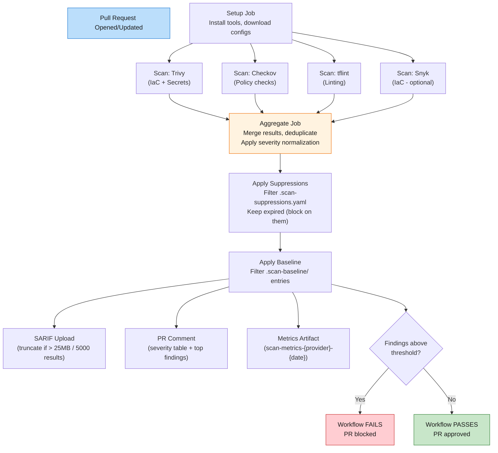
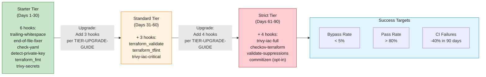
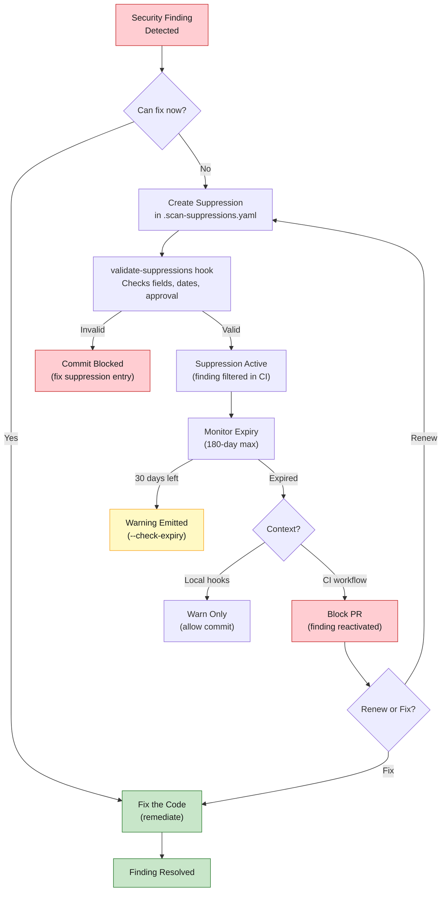
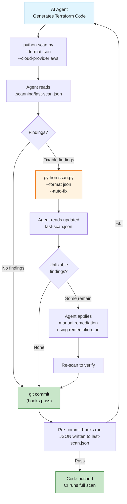
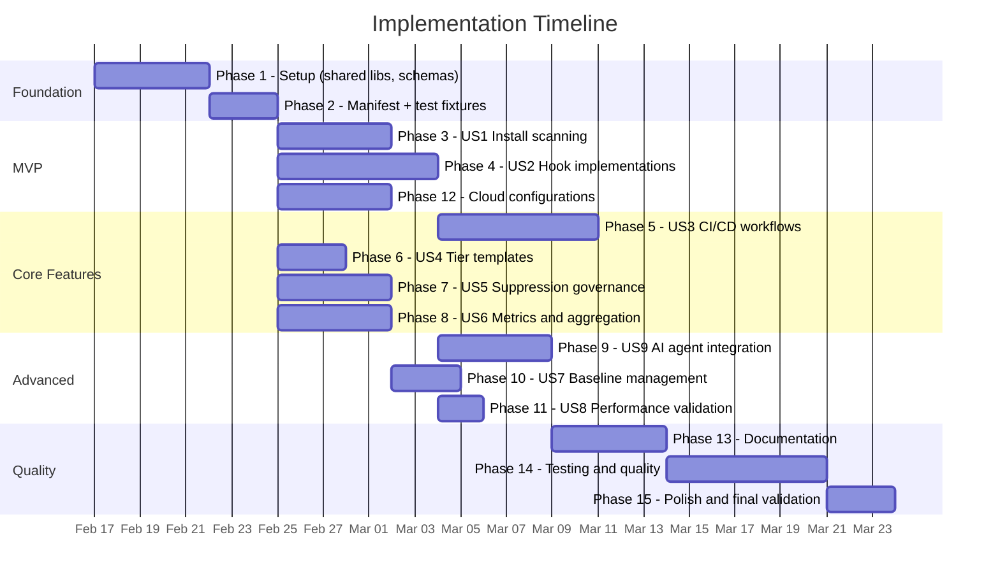

# Reusable Terraform Security Scanning Solution
## Presentation Slides

**Feature Branch**: `001-security-scanning-spec`
**Date**: 2026-02-11

● The presentation file has been created. Let me verify the Mermaid diagram count and overall structure.

● Searched for 3 patterns (ctrl+o to expand)

● The presentation file is complete. Here's a summary:                                                                              
  File: specs/001-security-scanning-spec/presentation-slides.md                                                                     
  Structure:
  - 32 slides + 2 appendix slides (34 total sections with speaker notes)
  - 9 Mermaid diagrams:
    a. Solution Architecture (flowchart)
    b. Two-Layer Defense Model (flowchart)
    c. Hook Execution Flow (flowchart)
    d. Multi-Cloud Config Structure (flowchart)
    e. CI/CD Workflow Architecture (flowchart)
    f. Tier Progression (flowchart)
    g. Suppression Lifecycle (flowchart)
    h. AI Agent Scan-Fix-Commit Flow (flowchart)
    i. Implementation Timeline (gantt)

  Slide narrative:
  - Slides 1-2: Title + Agenda
  - Slides 3-5: Problem Statement (cost, fragmentation, bypass problem)
  - Slides 6-7: Solution Overview + Architecture diagram
  - Slides 8-10: Two-Layer Defense + Core Principles (4 slides)
  - Slides 11-13: Hook System (overview, dual wrappers, flow diagram)
  - Slides 14-15: Multi-Cloud Support + config structure diagram
  - Slides 16-18: CI/CD Integration (overview, workflow diagram, PR experience)
  - Slides 19-20: Phased Adoption (tiers table, progression diagram)
  - Slides 21-22: Suppression Governance + lifecycle diagram
  - Slides 23-24: Metrics & Baselines
  - Slides 25-26: AI Agent Integration + flow diagram
  - Slides 27-28: Quick Start + Implementation Scope
  - Slides 29-30: Timeline gantt + Success Criteria
  - Slides 31-32: Benefits Summary + Q&A
  - Appendices: Severity Normalization + Exit Code Contract

  All data points verified against spec.md (NIST 30x, IBM $10.22M, performance thresholds, hook counts, tier compositions, success
  criteria targets).

✻ Cogitated for 5m 47s
---

## Slide 1: Title

# Reusable Terraform Security Scanning

**Catch security issues before they reach production**

A shared, multi-cloud pre-commit and CI/CD security scanning solution
for Terraform repositories across the organization.

> **Speaker Notes**: Welcome everyone. Today I'm presenting our Terraform Security Scanning solution — a reusable framework that brings consistent, automated security scanning to every Terraform repository in the organization. This is a shift-left approach: we catch issues at the developer's desk, not in production.

---

## Slide 2: Agenda

1. **The Problem** — Why we need this now
2. **Solution Overview** — Architecture and design principles
3. **Hook System** — Pre-commit and pre-push scanning
4. **Multi-Cloud Support** — AWS, Azure, GCP configurations
5. **CI/CD Integration** — GitHub Actions reusable workflows
6. **Phased Adoption** — Starter, Standard, Strict tiers
7. **Suppression Governance** — Managing exceptions responsibly
8. **Metrics & Baselines** — Measuring success
9. **AI Agent Integration** — Autonomous scanning workflows
10. **Getting Started** — 5-minute setup

> **Speaker Notes**: Here's our agenda. We'll go from the problem through the full solution, and end with how any team can get started in under 5 minutes. I'll cover the technical architecture, the adoption strategy, and the governance model.

---

## Slide 3: The Cost of Late Fixes

# Security Issues Cost 30x More to Fix in Production

| Stage | Relative Cost | Example |
|-------|--------------|---------|
| Development (pre-commit) | **1x** | Developer fixes open S3 bucket before commit |
| Build/CI | **6x** | PR blocked, developer context-switches back |
| Production | **30x** | Incident response, compliance findings, breach risk |

**Source**: NIST — verified 30x cost multiplier for production vs. development fixes

**IBM 2024**: Average US data breach cost: **$10.22M**

> **Speaker Notes**: NIST research shows fixing security issues in production costs 30 times more than catching them during development. IBM's 2024 report puts the average US data breach at $10.22 million. These are the verified statistics — we specifically avoid unverified 100x or 640x multipliers. The business case is clear: catch issues early, save money and risk.

---

## Slide 4: Fragmented Scanning Today

# The Current State: Inconsistent and Manual

**Problems across our Terraform repositories**:

- No standardized scanning tools or configurations
- Teams independently configure Trivy, Checkov, tflint (or don't)
- Different severity thresholds across repos
- No shared exclusion lists — each team fights the same false positives
- No metrics on scanning adoption or bypass rates
- Security findings discovered late in CI or by audit teams

> **Speaker Notes**: Today, every team is on their own. Some teams use Trivy, some use Checkov, some use nothing. Even teams that scan have different configurations and thresholds. There's no visibility into who's scanning, what they're finding, or whether scanning is actually being enforced. False positives aren't curated centrally, so every team wastes time on the same noisy checks.

---

## Slide 5: The Bypass Problem

# Developers Can Skip Hooks — And They Do

- `git commit --no-verify` bypasses all pre-commit hooks
- Without CI enforcement, bypassed scans leave gaps
- Without metrics, leadership can't see the problem
- Slow hooks get bypassed more frequently

**Our targets**:
- Hook bypass rate: **< 5%**
- Hook pass rate on first attempt: **> 80%**
- Individual hook runtime: **< 5 seconds**

> **Speaker Notes**: Any developer can type --no-verify and skip hooks entirely. We accept that reality and build defense-in-depth. Our bypass detection workflow catches skipped commits, CI re-scans everything, and metrics track bypass rates. We target less than 5% bypass rate. The key insight: fast hooks don't get bypassed. Every hook must complete in under 5 seconds.

---

## Slide 6: Solution Overview

# A Shared, Reusable Security Scanning Framework

**What we're building**:

- A central repository of pre-commit hooks, CI workflows, and configs
- Consumed by any Terraform repo via `pre-commit` framework's `repo:` URL
- Multi-cloud support: AWS, Azure, GCP — driven by configuration, not code
- Three adoption tiers for phased rollout (Starter → Standard → Strict)
- AI agent compatibility for autonomous scan-fix-commit workflows

**Design principles**:
1. **Cloud Agnostic** — Config-driven, no provider branching in code
2. **Zero-Friction** — 5-minute setup with a single script
3. **Version Controlled** — Pinned tags, SemVer, opt-in updates
4. **Override Friendly** — Customize anything without forking
5. **Performance First** — CRITICAL at commit, full scan at push
6. **Tested** — Integration tests for every hook, every provider

> **Speaker Notes**: Our solution is a shared Git repository that other repos consume as a dependency. It provides pre-commit hooks, GitHub Actions workflows, and tool configurations. Teams point their pre-commit config at our repo and get standardized scanning. Six core principles from our project constitution guide every design decision. The most important: zero-friction installation and performance-first scanning.

---

## Slide 7: Solution Architecture



> **Speaker Notes**: Here's the high-level architecture. The central repository — our shared scanning repo — contains hooks, configs, workflows, templates, and scripts. Consuming repositories reference it via their pre-commit config, pinned to a specific version tag. During setup, cloud-specific configs are copied to a local .scanning/configs/ directory. Hooks run at commit and push time, writing results locally. CI workflows provide the server-side safety net.

---

## Slide 8: Two-Layer Defense Model



> **Speaker Notes**: This is our two-layer defense model. Layer 1 runs locally on the developer's machine via pre-commit hooks. The commit stage runs fast checks in under 10 seconds — CRITICAL IaC findings, secret detection, and credential scanning. The push stage adds full severity scanning, Checkov policy checks, tflint, and suppression validation. Layer 2 is CI/CD — GitHub Actions re-scans everything, uploads SARIF to the Security tab, posts PR comments, and collects metrics. Even if a developer bypasses local hooks, CI catches it.

---

## Slide 9: Core Principles — Fail-Open and Performance

# Two Principles That Drive Adoption

### Fail-Open for Infrastructure Errors
- Tool crash, corrupted database, timeout → **allow the commit** with a warning
- Only actual security findings (exit code 1) block commits
- Prevents developer frustration from broken tooling

### Performance Budget
| Stage | Budget | Hooks |
|-------|--------|-------|
| Pre-commit (per hook) | < 5 seconds | trivy-iac-critical, trivy-secrets, gitleaks |
| Pre-commit (total) | < 10 seconds | All commit-stage hooks |
| Pre-push (total) | < 60 seconds | Full scan, Checkov, tflint |
| Setup | < 5 minutes | One-time installation |

> **Speaker Notes**: Two principles that make or break adoption. First: fail-open. If Trivy crashes or the database is corrupted, we warn and allow the commit. Only real security findings block. This prevents the scenario where a tool bug blocks the entire team. Second: strict performance budgets. Every hook must complete in under 5 seconds. CI validates performance on every PR to this repo. Slow hooks get bypassed — so we never let hooks get slow.

---

## Slide 10: Core Principles — Override-Friendly and Tested

# Customize Without Forking

### Override Points (Consuming Repos)
```yaml
# In your .pre-commit-config.yaml
hooks:
  - id: trivy-iac-critical
    args: ["--severity", "CRITICAL,HIGH"]   # Override severity
    stages: [pre-push]                       # Override stage
    exclude: 'terraform/legacy/.*'           # Override exclusions
```

### Tested at Every Level
- **8 test fixtures**: valid, secret, critical, AWS-fail, Azure-fail, GCP-fail
- **Integration tests**: Every hook against every fixture
- **Performance tests**: CI-enforced timing thresholds
- **Schema validation**: JSON output validated against schemas

> **Speaker Notes**: The override-friendly principle means any team can customize severity levels, hook stages, file patterns, and exclusions — all from their own pre-commit config. No forking required. And every hook has integration tests with real Terraform fixtures covering all three cloud providers. CI runs these on every PR. New hooks can't merge without passing fixtures.

---

## Slide 11: Hook System Overview

# 9 Hooks Across 2 Stages

| Hook ID | Tool | Stage | What It Catches |
|---------|------|-------|-----------------|
| `trivy-iac-critical` | Trivy | pre-commit | CRITICAL IaC misconfigurations |
| `trivy-secrets` | Trivy | pre-commit | Hardcoded secrets and API keys |
| `gitleaks` | Gitleaks | pre-commit | Leaked credentials |
| `validate-suppressions` | Python | pre-commit | Invalid suppression entries |
| `trivy-iac-full` | Trivy | pre-push | All severity IaC findings |
| `checkov` | Checkov | pre-push | CIS Benchmark policy checks |
| `checkov-strict` | Checkov | pre-push | Hard-fail on CRITICAL+HIGH |
| `tflint` | tflint | pre-push | Terraform linting + provider rules |
| `snyk-iac` | Snyk | pre-push | IaC misconfigurations (optional, requires license) |

> **Speaker Notes**: We provide 9 hooks total. Four run at commit time — they're fast, catching only the most critical issues. Five run at push time — they're more thorough, running full severity scans and policy checks. The snyk-iac hook is optional — it fails open gracefully when Snyk CLI is not installed or not authenticated. The split ensures developers get fast feedback on commits while comprehensive scanning happens before code reaches the remote.

---

## Slide 12: Hook Architecture — Dual Wrappers

# Cross-Platform: Every Hook Works on Windows, macOS, and Linux

**Architecture**: Each hook has both `.sh` (Bash) and `.ps1` (PowerShell) entry scripts

```
hooks/
├── dispatcher.sh           # OS detection → routes to .sh or .ps1
├── trivy-iac-critical.sh   # Bash wrapper
├── trivy-iac-critical.ps1  # PowerShell wrapper
├── trivy-secrets.sh
├── trivy-secrets.ps1
├── checkov.sh
├── checkov.ps1
├── snyk-iac.sh
├── snyk-iac.ps1
├── validate-suppressions.py  # Python (cross-platform natively)
└── lib/
    ├── common.sh             # Shared functions (fail-open, JSON output)
    └── common.ps1            # PowerShell equivalents
```

**Key behaviors** (shared across all hooks):
- `fail_open()` — Infrastructure errors exit 0 with warning
- `write_json()` — Write findings to `.scanning/last-scan.json`
- `detect_changed_dirs()` — Monorepo incremental scanning
- `verbose_output()` — Controlled by `SCAN_VERBOSE` env var

> **Speaker Notes**: Every hook has dual entry scripts — Bash for macOS/Linux and PowerShell for Windows. The dispatcher.sh script auto-detects the OS and routes to the right one. Shared libraries provide common functions like fail-open error handling, JSON output for AI agents, incremental scanning for monorepos, and configurable verbosity. The validate-suppressions hook is written in Python since PyYAML is cross-platform natively.

---

## Slide 13: Hook Execution Flow



> **Speaker Notes**: Here's the execution flow for every hook. The dispatcher detects the OS and routes to the right script. The hook detects which Terraform directories have changed files — this is the monorepo-aware incremental scanning. If no Terraform was changed, it skips instantly. The scanning tool runs and we classify the exit code: 1 means real findings (block), 0 means clean (pass), anything else is an infrastructure error (fail-open with warning). For Trivy, if we detect a database lock contention error, we retry once after 2 seconds.

---

## Slide 14: Multi-Cloud Support

# One Solution, Three Cloud Providers

| Component | AWS | Azure | GCP |
|-----------|-----|-------|-----|
| Checkov config | `configs/aws/.checkov.yaml` | `configs/azure/.checkov.yaml` | `configs/gcp/.checkov.yaml` |
| tflint config | `configs/aws/.tflint.hcl` | `configs/azure/.tflint.hcl` | `configs/gcp/.tflint.hcl` |
| Policy overlay | `configs/aws/policy-overlay.yaml` | `configs/azure/policy-overlay.yaml` | `configs/gcp/policy-overlay.yaml` |
| Noisy checks list | `configs/common/noisy-checks-aws.yaml` | `configs/common/noisy-checks-azure.yaml` | `configs/common/noisy-checks-gcp.yaml` |

**Cloud-agnostic** (no provider config needed):
- Trivy IaC scanning
- Trivy secret detection
- Gitleaks credential scanning

**Config approach**: **Blocklist** — all checks enabled by default, config lists exclusions only. New checks auto-activate on tool update.

> **Speaker Notes**: Multi-cloud is configuration-driven, not code-driven. Each cloud provider gets its own Checkov config, tflint config, policy overlay, and curated noisy-checks exclusion list. Trivy and Gitleaks are cloud-agnostic — they work without provider-specific config. We use a blocklist approach for Checkov: all checks are enabled by default, and we only list exclusions. This means when Checkov releases new checks, they automatically activate. The noisy-checks lists are centrally curated to prevent every team from fighting the same false positives.

---

## Slide 15: Multi-Cloud Configuration Structure



> **Speaker Notes**: Configs are split into two layers: universal security checks — things like encryption, public access prevention, and logging — and organization-specific policy overlays for tagging and naming conventions. The policy overlay is explicitly designed to be replaced by consuming repos. During setup, the setup script copies the provider-specific configs to .scanning/configs/ in the consuming repo. Hooks reference configs via explicit --config-file flags, leaving any existing repo-root configs untouched.

---

## Slide 16: CI/CD Integration Overview

# Reusable GitHub Actions Workflow

**Consuming repos call our workflow with one line**:

```yaml
jobs:
  security-scan:
    uses: {org}/auto-code-scanning/.github/workflows/reusable-scan.yml@v1.0.0
    with:
      terraform-directory: "terraform/"
      cloud-provider: "aws"
      severity: "CRITICAL,HIGH"
    permissions:
      contents: read
      security-events: write    # For SARIF upload
      pull-requests: write      # For PR comments
```

**Input parameters**: `terraform-directory`, `cloud-provider`, `severity`, `fail-on-findings`, `upload-sarif`, `post-pr-comment`, `apply-suppressions`, `apply-baseline`, `upload-metrics`

**All features are opt-out** — defaults are `true` for everything.

> **Speaker Notes**: CI integration is a single workflow_call reference in the consuming repo's GitHub Actions. It accepts 9 input parameters, all with sensible defaults. SARIF upload, PR comments, suppression filtering, baseline filtering, and metrics upload are all on by default. Teams without certain GitHub permissions can opt out of SARIF upload or PR comments individually. This design means the simplest possible CI config gets full scanning.

---

## Slide 17: CI/CD Workflow Architecture



> **Speaker Notes**: The CI workflow has a clear pipeline. After tool setup, three scan jobs run in parallel — Trivy, Checkov, and tflint. Results are aggregated with cross-tool deduplication and severity normalization. Then suppressions are applied — active suppressions filter out known issues, but expired suppressions are kept and blocked on. Baselines filter known technical debt. Finally, SARIF uploads to the Security tab (with truncation for GitHub's 25MB/5000 limit), a PR comment is posted with a severity table, and metrics are uploaded as an artifact for cross-repo tracking.

---

## Slide 18: PR Experience

# What Developers See on Pull Requests

### PR Comment (posted automatically on every scan)

```
## Security Scan Results

| Severity | Count |
|----------|-------|
| CRITICAL | 1     |
| HIGH     | 2     |
| MEDIUM   | 5     |
| LOW      | 3     |

Tools: Trivy, Checkov, tflint
Suppressions applied: 2
Baseline filtered: 8

<details>
<summary>Top findings (click to expand)</summary>

| File | Rule | Severity | Tool | Remediation |
|------|------|----------|------|-------------|
| main.tf:42 | CKV_AWS_19 | CRITICAL | Checkov | Link |
| main.tf:58 | AVD-AWS-0107 | HIGH | Trivy | Link |
</details>
```

**Checkov findings include auto-generated remediation URLs** (e.g., `docs.checkov.io/docs/CKV_AWS_19`)

> **Speaker Notes**: On every PR, developers see a clean summary comment with a severity table, tool list, suppression and baseline counts, and a collapsible section with the top findings. Each Checkov finding includes a direct link to remediation docs. A new comment is posted on each scan run — we don't update or collapse old comments, so developers can see the progression. SARIF results also appear in the GitHub Security tab for long-term tracking.

---

## Slide 19: Phased Adoption — Three Tiers

# 90-Day Rollout: Starter → Standard → Strict

| | Starter (Days 1-30) | Standard (Days 31-60) | Strict (Days 61-90) |
|---|---|---|---|
| **Secret detection** | Block | Block | Block |
| **CRITICAL IaC** | Block | Block | Block |
| **Full IaC scan** | — | Pre-push | Pre-push |
| **Checkov policy** | — | Pre-push | Pre-push |
| **Checkov strict** | — | — | Pre-push |
| **tflint linting** | — | Pre-push | Pre-push |
| **Suppression validation** | — | Pre-commit | Pre-commit |
| **Hook count** | 6 | 9 | 11+ |

**Phase timelines are guidelines, not deadlines.** Teams that miss milestones extend the current phase until criteria are met. No mandatory rollback or escalation.

> **Speaker Notes**: Phased adoption is critical for reducing developer friction. Teams start with the Starter tier — just secrets and formatting checks. After 30 days, they upgrade to Standard, adding linting and CRITICAL IaC scanning. By day 90, Strict tier enables full enforcement including Checkov policy validation. The timelines are flexible guidelines — a team that needs 45 days on Starter just stays on Starter until they're ready. Templates are copy-once references: teams merge new hooks from upgrade docs while keeping their customizations. Additionally, the Snyk IaC hook is available as an optional add-on in Standard and Strict tiers for teams that have a Snyk license — it's commented out by default and fails open gracefully when the CLI is not present.

---

## Slide 20: Tier Progression



> **Speaker Notes**: Each tier transition has a documented upgrade guide listing exactly which hooks to add. Starter to Standard adds 3 hooks. Standard to Strict adds 4. The commitizen hook in Strict is commented out with opt-in instructions — commit message conventions are a team workflow preference, not a security concern. By the end of the 90-day program, teams should hit our success targets: less than 5% bypass rate, over 80% first-attempt pass rate, and a 40% reduction in CI security failures.

---

## Slide 21: Suppression Governance

# Managing Exceptions Responsibly

**Every suppression requires governance fields**:

```yaml
trivy_suppressions:
  - rule_id: AVD-AWS-0057          # REQUIRED: Check ID
    tool: trivy                     # REQUIRED: Source tool
    severity: HIGH                  # OPTIONAL
    reason: "Legacy VPC - migrating Q3"  # REQUIRED: Business justification
    owner: "team-lead@company.com"  # REQUIRED: Responsible party
    approved_date: "2026-02-01"     # REQUIRED: ISO date
    expires_date: "2026-07-30"      # REQUIRED: Max 180 days
    approved_by: "sec-eng@company.com"  # REQUIRED for HIGH/CRITICAL
    ticket: "JIRA-1234"            # OPTIONAL: Issue reference
```

**Enforcement**:
- Max 180-day expiry from approval date
- HIGH/CRITICAL suppressions require `approved_by` (security team)
- Approval trust is honor-system with `git blame` as audit trail
- Validation is syntax-only — no cross-reference to actual findings

> **Speaker Notes**: Suppressions are the escape valve — without them, teams fork the solution or ignore it entirely. But every suppression has governance fields: who owns it, who approved it, when it expires, and why. HIGH and CRITICAL suppressions require security team approval. The maximum expiry is 180 days — suppressions can't live forever. Trust is honor-system based with git blame providing the audit trail. The validation hook checks syntax and governance fields only — it doesn't verify that suppressed rule IDs actually exist in scan results.

---

## Slide 22: Suppression Lifecycle



> **Speaker Notes**: Here's the full suppression lifecycle. When a finding can't be fixed immediately, a developer creates a suppression entry with all governance fields. The validation hook checks it at commit time. Once active, the suppression filters the finding in CI. When the suppression approaches expiry, warnings are emitted. When it expires, the behavior differs: local hooks only warn (giving teams time), but CI immediately treats the finding as active and blocks the PR. Teams must then either renew the suppression or fix the underlying issue. This creates a forcing function — suppressions can't silently persist forever.

---

## Slide 23: Metrics & Reporting

# Measuring Adoption Health

**Key metrics collected**:

| Metric | Target | Source |
|--------|--------|--------|
| Hook bypass rate | < 5% | Heuristic detection + CI re-scan |
| Hook pass rate (first attempt) | > 80% | Hook execution results |
| CI security failure reduction | -40% in 90 days | CI workflow run history trend |
| Finding counts by severity | Trending down | Aggregated scan results |
| Suppressed/baselined counts | Tracking governance | Suppression + baseline data |

**Cross-tool deduplication**: When Trivy and Checkov both flag the same issue (e.g., unencrypted S3 bucket), findings are merged by `(file, resource, category)` into a single entry with a `detected_by` array listing all reporting tools.

**Cross-repo aggregation**: Metrics JSON uploaded as GitHub Actions artifacts. Query across repos via GitHub API.

**Severity normalization**: All 8 tools mapped to unified CRITICAL/HIGH/MEDIUM/LOW scale.

> **Speaker Notes**: Metrics demonstrate ROI and identify teams that need support. We track bypass rate, pass rate, finding trends, and governance metrics. The 40% CI security failure reduction target is measured from CI workflow run history — the before/after comes from the trend over 90 days, no separate baseline capture needed. Cross-tool deduplication prevents double-counting when Trivy and Checkov both flag the same issue. Metrics are uploaded as GitHub Actions artifacts and can be aggregated across the entire organization via the GitHub API.

---

## Slide 24: Baseline Management

# Handling Existing Technical Debt

**Problem**: Existing codebases have hundreds of pre-existing findings. Without baselines, scanning is overwhelming and gets abandoned.

**Solution**: Baseline captures current findings. Subsequent scans only report NEW issues.

```powershell
# Create a baseline for all tools
.\scripts\create-baseline.ps1 -CloudProvider aws

# Monorepo: scope to specific directory
.\scripts\create-baseline.ps1 -CloudProvider aws -MonorepoScope "terraform/networking"
```

**Matching algorithm**: `SHA-256(rule_id + "|" + file_path)` — O(1) lookup per finding

- **Line numbers are intentionally ignored** — resilient to code refactoring
- Baseline older than 90 days triggers a staleness warning
- Findings can be both baselined AND suppressed independently
- `-Force` parameter refreshes an existing baseline

> **Speaker Notes**: Baselines are essential for adopting scanning on existing codebases. Without them, teams see 200+ findings on day one and give up. The baseline captures the current state and all subsequent scans only report new findings. The matching algorithm uses a hash of rule_id plus file_path — we intentionally exclude line numbers so that moving code around doesn't break baseline matching. A finding can be both baselined and suppressed independently — neither mechanism overrides the other. Baselines older than 90 days trigger a staleness warning.

---

## Slide 25: AI Agent Integration

# Autonomous Scan-Fix-Commit Workflows

**Two paths for AI agents**:

| Path | Entry Point | Use Case |
|------|------------|----------|
| Pre-commit hooks | `git commit` | Agent commits code, hooks run automatically |
| Direct scanning | `python scripts/scan.py` | Agent scans independently of git |

**scan.py provides machine-readable output**:

```bash
# Scan and get JSON results
python scripts/scan.py --format json --cloud-provider aws terraform/

# Scan and auto-fix Checkov findings
python scripts/scan.py --format json --auto-fix terraform/

# Output always written to .scanning/last-scan.json
```

**Auto-fix workflow**: `scan.py --auto-fix` invokes Checkov's `--fix` flag for fixable checks, applies remediations in-place, and reports what was fixed vs. what remains.

> **Speaker Notes**: AI coding agents like Claude Code are a growing development pattern. Our solution has first-class agent support through two paths. First, when agents commit code, pre-commit hooks run automatically and write structured JSON to .scanning/last-scan.json — agents can parse this file. Second, agents can run scan.py directly for scanning independent of the git workflow. The --auto-fix flag is the key differentiator: it invokes Checkov's built-in fix capability, automatically remediating fixable findings and reporting what's left. This enables fully autonomous scan-fix-commit loops.

---

## Slide 26: AI Agent Scan-Fix-Commit Flow



> **Speaker Notes**: Here's the full agent workflow. The agent generates Terraform code, runs scan.py to get structured findings, and reads the JSON output. If there are fixable findings, it runs scan.py with --auto-fix — Checkov remediates what it can. The agent reads the updated results, applies manual fixes for anything remaining using the remediation URLs in the output, and re-scans to verify. When clean, the agent commits — hooks run as a final gate. If hooks fail, the agent loops back. This is a fully autonomous secure coding workflow.

---

## Slide 27: Quick Start — 5 Minutes to Scanning

# Getting Started

### Step 1: Run Setup (pick your OS)

```bash
# Cross-platform (macOS, Linux, Windows)
python scripts/setup-scanning.py --cloud-provider aws --tier starter

# Windows (PowerShell)
.\scripts\setup-scanning.ps1 -CloudProvider aws -Tier starter
```

### Step 2: Make a Commit

```bash
git add . && git commit -m "Add security scanning"
```

Hooks run automatically — CRITICAL findings and secrets are blocked.

### Step 3: Review Results

```bash
cat .scanning/last-scan.json    # Machine-readable
# Human-readable summary printed to terminal
```

### Step 4: Add CI (one workflow reference)

```yaml
uses: {org}/auto-code-scanning/.github/workflows/reusable-scan.yml@v1.0.0
with:
  cloud-provider: "aws"
```

> **Speaker Notes**: Getting started takes under 5 minutes. Step 1: run the setup script with your cloud provider and preferred tier. It installs Trivy, Checkov, tflint, Gitleaks, and pre-commit, copies configs, and activates hooks. Step 2: make a commit — hooks run automatically. Step 3: review results in the terminal or the JSON file. Step 4: add one workflow reference to your GitHub Actions for CI scanning. That's it. Teams can be scanning within a single standup timebox.

---

## Slide 28: Implementation Scope

# 92 Tasks, 15 Phases, 9 User Stories

| Phase | Scope | Tasks |
|-------|-------|-------|
| Phase 1-2 | Foundation (shared libs, schemas, manifest, fixtures) | 10 |
| Phase 3 | US1: Developer installs scanning | 3 |
| Phase 4 | US2: Developer commits secure code | 11 |
| Phase 5 | US3: CI/CD enforces security on PRs | 8 |
| Phase 6 | US4: Team adopts via 90-day rollout | 4 |
| Phase 7 | US5: Security engineer manages suppressions | 3 |
| Phase 8 | US6: Security manager reviews metrics | 3 |
| Phase 9 | US9: AI agent scans and auto-fixes | 2 |
| Phase 10-11 | US7-US8: Baselines + performance validation | 2 |
| Phase 12 | Cloud configurations (all 3 providers) | 12 |
| Phase 13-15 | Documentation, testing, polish | 21 |

**MVP** (Phases 1-4 + 12): **33 tasks** — Developers can install + commit with scanning

**45+ parallel opportunities** identified across 6 phases

> **Speaker Notes**: The implementation is organized into 79 tasks across 15 phases, mapped to 9 user stories from the spec. The MVP is 33 tasks covering the foundation, installation, hook system, and cloud configs — enough for developers to install and use scanning locally. After MVP, we incrementally add CI, templates, governance, and AI agent support. Over 45 tasks can run in parallel across phases, enabling fast delivery with a team of 3 developers.

---

## Slide 29: Implementation Timeline



> **Speaker Notes**: Here's a rough implementation timeline. Foundation work takes about a week. The MVP — install, hooks, and cloud configs — can be delivered in parallel across 2-3 weeks after that. Core features like CI, templates, suppressions, and metrics follow. Advanced features including AI agent integration and baseline management build on earlier phases. Quality work — docs, testing, and polish — wraps up the release. With 3 developers working in parallel on different user stories, we can significantly compress this timeline.

---

## Slide 30: Success Criteria

# How We Know It's Working

| # | Criteria | Target | Measurement |
|---|----------|--------|-------------|
| SC-001 | Setup time | < 5 minutes | Timed end-to-end on all 3 OS |
| SC-002 | Pre-commit speed | < 10 seconds | CI performance benchmarks |
| SC-003 | Bypass rate | < 5% | CI artifact aggregation across repos |
| SC-004 | Pass rate (first attempt) | > 80% | Hook execution metrics |
| SC-005 | Cloud coverage | 3/3 providers | Config + fixture validation |
| SC-006 | Test accuracy | 100% expected outcomes | Clean passes, fail fixtures fail |
| SC-007 | CI failure reduction | -40% in 90 days | Workflow run history trend |
| SC-008 | Local/CI parity | Identical pass/fail | Integration test comparison |
| SC-009 | AI agent auto-fix | Checkov-fixable findings | scan.py + --auto-fix validation |

> **Speaker Notes**: We have 9 measurable success criteria. Setup under 5 minutes. Hooks under 10 seconds. Less than 5% bypass rate. Over 80% first-attempt pass rate. Complete coverage for all three cloud providers. 100% test accuracy — clean fixtures pass, fail fixtures fail. 40% reduction in CI security failures within 90 days of adoption. Identical outcomes locally and in CI. And AI agents can successfully auto-fix Checkov-fixable findings. Every one of these is measurable from existing CI data and metrics artifacts.

---

## Slide 31: Key Benefits Summary

# Why This Solution

| Benefit | How |
|---------|-----|
| **Shift-left security** | Catch issues at commit time, not in production (NIST 30x savings) |
| **Consistency** | Same hooks, configs, and thresholds across every Terraform repo |
| **Multi-cloud** | AWS, Azure, GCP — one solution, configuration-driven |
| **Low friction** | 5-minute setup, < 5s per hook, phased adoption |
| **Governance** | Governed suppressions, metrics, baselines, audit trails |
| **Defense in depth** | Local hooks + CI enforcement — bypasses are caught |
| **Future-proof** | AI agent integration, auto-fix, version-controlled updates |
| **Centrally maintained** | One team curates noisy checks, configs, and templates for all |
| **Override friendly** | Customize anything without forking |

> **Speaker Notes**: To summarize the key benefits. We shift security left to where it's cheapest to fix. We provide consistency across every Terraform repo. Multi-cloud support means one solution for the whole organization. Low friction means teams actually use it. Governance means exceptions are tracked and expire. Defense in depth means bypasses don't create gaps. AI agent integration future-proofs us for autonomous coding workflows. Central maintenance means one team curates the solution for everyone. And override-friendly design means teams can adapt without forking.

---

## Slide 32: Q&A

# Questions?

**Resources**:
- Feature Spec: `specs/001-security-scanning-spec/spec.md`
- Implementation Plan: `specs/001-security-scanning-spec/plan.md`
- Task List: `specs/001-security-scanning-spec/tasks.md` (79 tasks)
- Data Model: `specs/001-security-scanning-spec/data-model.md`
- Quick Start: `specs/001-security-scanning-spec/quickstart.md`
- Contracts: `specs/001-security-scanning-spec/contracts/`

**Key contacts**:
- Repo: `auto-code-scanning`
- Branch: `001-security-scanning-spec`

> **Speaker Notes**: Thank you for your time. All the detailed specs, plans, task lists, data models, and contracts are available in the spec directory. The feature branch has everything. Happy to take questions on the architecture, adoption strategy, technical details, or timeline.

---

## Appendix: Severity Normalization Reference

| Tool | Source Value | Normalized |
|------|------------|------------|
| **Trivy** | CRITICAL / HIGH / MEDIUM / LOW / UNKNOWN | CRITICAL / HIGH / MEDIUM / LOW / LOW |
| **Checkov** | CRITICAL / HIGH / MEDIUM / LOW | Direct mapping |
| **tflint** | error / warning / notice | HIGH / MEDIUM / LOW |
| **Gitleaks** | (all secrets) | HIGH |
| **PSScriptAnalyzer** | Error / Warning / Information | HIGH / MEDIUM / LOW |
| **ShellCheck** | error / warning / info / style | HIGH / MEDIUM / LOW / LOW |
| **hadolint** | error / warning / info / style | HIGH / MEDIUM / LOW / LOW |
| **Snyk** | critical / high / medium / low | CRITICAL / HIGH / MEDIUM / LOW |

> **Speaker Notes**: This is the reference table for severity normalization across all 8 supported tools. Trivy's UNKNOWN maps to LOW. tflint errors map to HIGH. Gitleaks always maps to HIGH since all secret findings are considered high severity. Snyk uses lowercase severity values which map directly to the normalized uppercase equivalents. This normalization enables unified reporting and consistent thresholds regardless of which tool detected the issue.

---

## Appendix: Hook Exit Code Contract

| Exit Code | Meaning | Hook Behavior |
|-----------|---------|---------------|
| `0` | No findings / clean scan | Allow commit/push |
| `1` | Security findings detected | **Block commit/push** |
| `2+` | Infrastructure error (tool crash, DB lock, timeout) | **Allow with warning (fail-open)** |

**Critical rule**: Exit code `1` is ONLY for real security findings. Tool crashes, network failures, and parse errors MUST exit `2+` to trigger fail-open.

> **Speaker Notes**: The exit code contract is fundamental to the fail-open design. Only exit code 1 blocks — and it must only be used for real security findings. Any other non-zero exit code is treated as an infrastructure error and the hook allows the commit with a prominent warning. This prevents tool bugs from blocking entire teams while still catching actual security issues.
