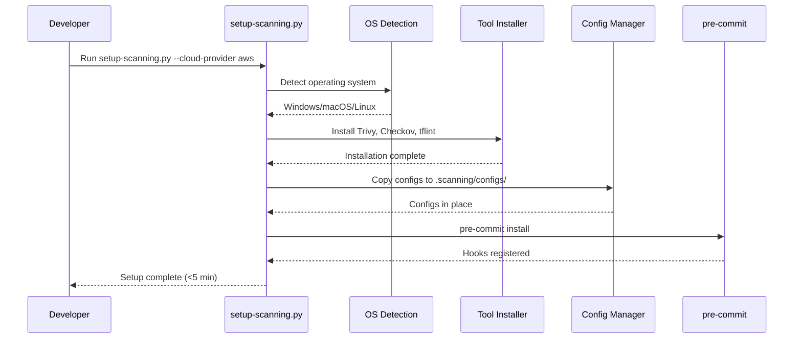
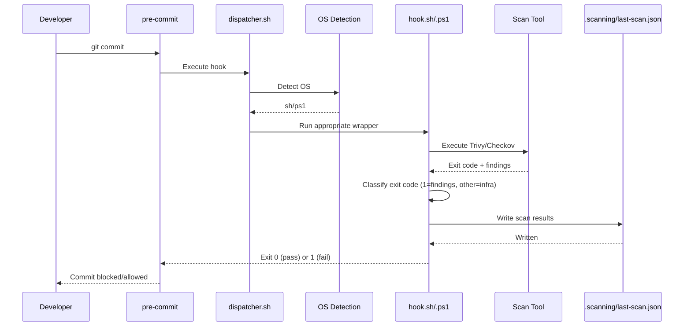
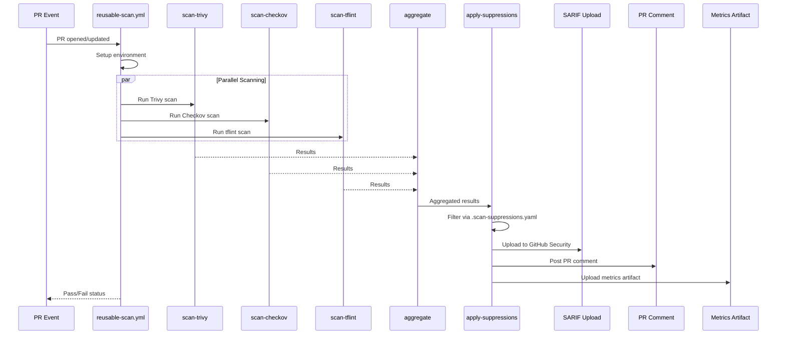
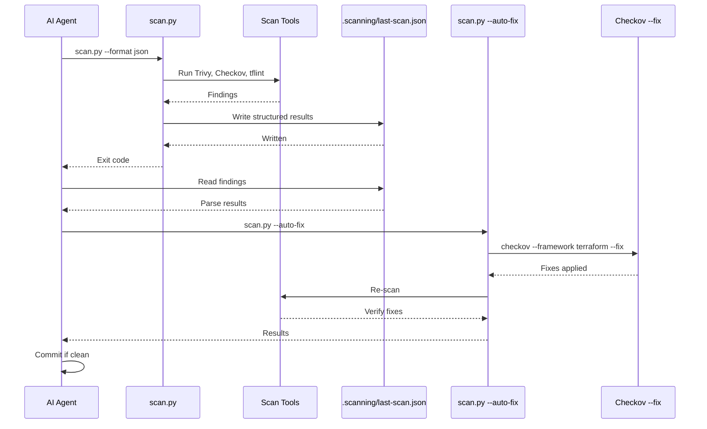

# Implementation Plan: Reusable Terraform Security Scanning Solution

**Branch**: `001-security-scanning-spec` | **Date**: 2026-02-10 | **Spec**: [spec.md](spec.md)
**Input**: Feature specification from `/specs/001-security-scanning-spec/spec.md`

## Summary

Build a reusable, multi-cloud Terraform security scanning solution providing shared pre-commit hooks (with dual .sh/.ps1 wrappers), reusable GitHub Actions workflows, tiered adoption templates, and AI agent integration. The system implements a two-layer defense (local hooks + CI enforcement) across AWS, Azure, and GCP with fail-open error handling, incremental monorepo scanning, and structured JSON output for machine consumption.

## Technical Context

**Language/Version**: PowerShell 7+ (Windows scripts), Python 3.8+ (cross-platform: scan.py, setup-scanning.py, validate-suppressions.py), Bash (Unix hook wrappers)
**Primary Dependencies**: pre-commit framework 3.0+, Trivy >=0.48.0, Checkov >=3.0.0, tflint >=0.50.0, PyYAML (Python)
**Storage**: JSON files (.scanning/last-scan.json, .scan-baseline/, .scan-results/), YAML configs (.scan-suppressions.yaml)
**Testing**: Pester 5+ (PowerShell), pytest (Python), Terraform fixtures (integration), GitHub Actions CI
**Target Platform**: Windows (primary), macOS, Linux — all via pre-commit framework
**Project Type**: Shared library/framework (consumed by other repositories via pre-commit `repo:` URL)
**Performance Goals**: <5s per hook, <10s total pre-commit, <60s total pre-push, <5min setup
**Constraints**: Offline-capable after setup (--skip-db-update), no external services, GitHub Actions CI only
**Scale/Scope**: ~57 source files, 9 PS1 scripts, 3 workflows, 7+ config files, 5 test fixtures, 16+ docs

## Constitution Check

*GATE: Must pass before Phase 0 research. Re-check after Phase 1 design.*

| Principle | Status | Evidence |
|-----------|--------|----------|
| I. Cloud Agnostic | PASS | Configs isolated in `configs/{aws,azure,gcp}/`; hooks/workflows contain zero provider branching; new provider = new config dir only |
| II. Zero-Friction Installation | PASS | Single script: `setup-scanning.py --cloud-provider aws` (<5 min); also PS1 variants for Windows. No manual config editing |
| III. Version Controlled | PASS | Templates pin `rev: v1.0.0`; SemVer policy in constitution; CHANGELOG exists; `pre-commit autoupdate` for opt-in upgrades |
| IV. Override Friendly | PASS | All hooks expose `args:`, `stages:`, `files:`, `exclude:` in manifest; severity/config overridable; suppression mechanism with governance |
| V. Performance First | PASS | CRITICAL at pre-commit (<5s), full scan at pre-push (<60s); CI benchmarks every PR; incremental monorepo scanning |
| VI. Tested | PASS | Fixtures in `tests/fixtures/{valid,aws-fail,azure-fail,gcp-fail,secret}/`; CI runs integration tests; Pester for PS1 scripts |
| Security Standards | PASS | CRITICAL blocks commits; suppression governance with 180-day expiry; `--skip-db-update` for offline; no code upload |
| Development Workflow | PASS | PR-required; hook changes need fixtures; multi-cloud validation; docs updated with changes |

**Gate Result**: ALL PASS — proceed to Phase 0.

## Kiro Design Cross-Reference

**File**: `.kiro/specs/terraform-security-scanning/design.md`

### Conflicts Identified (3)

| ID | Conflict | Resolution |
|----|----------|------------|
| KC-001 | Kiro uses `files: \.tf$` in hook manifest; Spec FR-011d requires matching ALL files with directory exclusions | **Use spec**: Change to `files: ''` with `exclude: '(\.terraform/\|node_modules/\|\.git/)'`; scanning tools determine relevance |
| KC-002 | Kiro's scan.py missing `import uuid`, `from datetime import datetime` and references 3 undefined helpers (`map_checkov_severity`, `count_by_severity`, `count_by_tool`) | **Fix during implementation**: Add missing imports and implement all helper functions |
| KC-003 | Kiro's Trivy retry logic greps non-existent `trivy.log`; Trivy outputs to stderr | **Fix during implementation**: Capture stderr via `2>&1` and grep from captured output |

### Analyze-Phase Conflicts (9)

| ID | Conflict | Severity | Resolution |
|----|----------|----------|------------|
| KC-004 | Starter tier lists 6 hooks in spec.md (including 3rd-party) but 3 in data-model.md | Low | Scope difference: data-model.md covers this repo's hooks only. Clarification note added to data-model.md |
| KC-005 | FR-009 says `language: system`, hook-interface.md says `language: script` | Medium | FR-009 corrected to `language: script` to match contracts |
| KC-006 | validate-suppressions exit 1 = validation errors vs hook contract exit 1 = security findings | Low | Reconciled: validation errors ARE the security concern. Note added to hook-interface.md |
| KC-007 | cloud-provider Required in workflow, Optional in CLI scan.py | Low | Intentional design: CI needs explicit config, CLI can auto-detect. Documented in cli-interface.md |
| KC-008 | Baseline `line` field informational-only not explicitly stated | Low | Already stated in FR-074b and data-model.md §Baseline matching. No change needed |
| KC-009 | No sequence diagrams in spec artifacts | Medium | Sequence diagrams added to plan.md §Key Workflow Sequences |
| KC-010 | Non-Checkov remediation URL fallback unspecified | Medium | FR-033g added to spec.md specifying URL templates per tool |
| KC-011 | 41 correctness properties not enumerated in spec artifacts | Low | Properties referenced from Kiro design file. Summary added to plan.md |
| KC-012 | Property test framework not specified | Low | Framework specified in plan.md §Correctness Properties |

### Kiro Patterns to Adopt (5)

1. **Fail-open error classification table** — exit code 1 = findings (block), all others = infrastructure (warn + allow)
2. **Dual-wrapper dispatcher architecture** — `hooks/dispatcher.sh` routes to `.sh` or `.ps1` based on OS
3. **Config layering** — universal security checks + replaceable `policy-overlay.yaml` per provider
4. **Baseline matching** — O(1) hash lookup on `(rule_id, file_path)` tuple
5. **41 correctness properties** — adopt as property-based test specifications

### Kiro Additions Beyond Spec (Adopted)

- Severity normalization for 7 tools (Trivy, Checkov, tflint, Gitleaks, PSScriptAnalyzer, ShellCheck, hadolint)
- Mermaid sequence diagrams for 4 workflows (installation, pre-commit, CI/CD, AI agent)
- Detailed unified-results JSON schema with `detected_by` array and `remediation_url`
- Partial tool installation recovery pattern with per-tool idempotent verification

## Key Workflow Sequences

### 1. Installation Flow



### 2. Pre-commit Hook Execution



### 3. CI/CD Scan Flow



### 4. AI Agent Scan-Fix Cycle



## Project Structure

### Documentation (this feature)

```text
specs/001-security-scanning-spec/
├── spec.md              # Feature specification (DONE)
├── plan.md              # This file
├── research.md          # Phase 0 output
├── data-model.md        # Phase 1 output
├── quickstart.md        # Phase 1 output
├── contracts/           # Phase 1 output
│   ├── hook-interface.md
│   ├── workflow-interface.md
│   ├── cli-interface.md
│   └── suppression-format.md
└── checklists/
    └── requirements.md  # Quality checklist (DONE)
```

### Source Code (repository root)

```text
.pre-commit-hooks.yaml          # Hook manifest (EXISTS - needs update)

hooks/                           # NEW: Hook entry scripts
├── dispatcher.sh                # OS-detecting dispatcher
├── trivy-iac-critical.sh        # Bash wrapper
├── trivy-iac-critical.ps1       # PowerShell wrapper
├── trivy-iac-full.sh
├── trivy-iac-full.ps1
├── trivy-secrets.sh
├── trivy-secrets.ps1
├── checkov.sh
├── checkov.ps1
├── checkov-strict.sh
├── checkov-strict.ps1
├── validate-suppressions.py     # Python (cross-platform)
└── lib/
    ├── common.sh                # Shared bash functions
    └── common.ps1               # Shared PowerShell functions

scripts/                         # EXISTS - needs updates + additions
├── setup-scanning.ps1           # EXISTS - add -CloudProvider param
├── setup-scanning-no-admin.ps1  # EXISTS - add -CloudProvider param
├── setup-scanning.py            # NEW: Cross-platform Python setup
├── scan.py                      # NEW: AI agent scanning interface
├── validate-suppressions.py     # NEW: Python rewrite (PyYAML)
├── create-baseline.ps1          # EXISTS - add matching algorithm
├── aggregate-scan-results.ps1   # EXISTS - add deduplication
├── collect-scan-metrics.ps1     # EXISTS - add CI artifact upload
├── profile-hook-performance.ps1 # EXISTS - add all hooks
├── verify-scanning.ps1          # EXISTS
└── generate-suppression-report.ps1  # EXISTS

configs/                         # EXISTS - needs blocklist conversion
├── aws/
│   ├── .checkov.yaml            # EXISTS - convert to blocklist
│   ├── .tflint.hcl              # EXISTS - add tflint-ruleset-terraform
│   └── policy-overlay.yaml      # NEW: Org-specific policy
├── azure/
│   ├── .checkov.yaml            # EXISTS - convert to blocklist
│   ├── .tflint.hcl              # EXISTS - add tflint-ruleset-terraform
│   └── policy-overlay.yaml      # NEW
├── gcp/
│   ├── .checkov.yaml            # EXISTS - convert to blocklist
│   ├── .tflint.hcl              # EXISTS - add tflint-ruleset-terraform
│   └── policy-overlay.yaml      # NEW
└── common/
    ├── .trivyignore             # EXISTS
    ├── .scan-suppressions.yaml  # EXISTS
    ├── noisy-checks-aws.yaml    # NEW: Shared exclusion list
    ├── noisy-checks-azure.yaml  # NEW
    └── noisy-checks-gcp.yaml    # NEW

templates/                       # EXISTS - needs updates
├── starter/
│   └── pre-commit-config.yaml   # EXISTS - verify hooks list
├── standard/
│   └── pre-commit-config.yaml   # EXISTS - remove no-commit-to-branch
├── strict/
│   └── pre-commit-config.yaml   # EXISTS - comment out commitizen
├── aws/
│   └── pre-commit-config.yaml   # EXISTS
├── azure/
│   └── pre-commit-config.yaml   # EXISTS
└── gcp/
    └── pre-commit-config.yaml   # EXISTS

.github/workflows/               # EXISTS - needs conversion + additions
├── reusable-scan.yml            # RENAME from terraform-security-scan.yml + convert to workflow_call
├── ci.yml                       # EXISTS - expand integration tests
├── bypass-detection.yml         # EXISTS
└── performance-check.yml        # NEW: Dedicated perf validation

schemas/
├── unified-results.schema.json  # EXISTS - add detected_by, baseline, suppressed fields
└── last-scan.schema.json        # NEW: Agent report schema

tests/
├── fixtures/                    # EXISTS
│   ├── terraform-valid/         # EXISTS - expand per provider
│   │   ├── aws/main.tf          # NEW (current is generic)
│   │   ├── azure/main.tf        # NEW
│   │   └── gcp/main.tf          # NEW
│   ├── terraform-aws-fail/      # EXISTS
│   ├── terraform-azure-fail/    # EXISTS
│   ├── terraform-gcp-fail/      # EXISTS
│   ├── terraform-secret/        # EXISTS
│   └── terraform-critical/      # NEW: CRITICAL-only fixtures
│       ├── aws/main.tf
│       ├── azure/main.tf
│       └── gcp/main.tf
├── unit/                        # EMPTY - needs Pester tests
│   ├── setup-scanning.Tests.ps1
│   ├── validate-suppressions.Tests.ps1
│   ├── aggregate-scan-results.Tests.ps1
│   └── collect-scan-metrics.Tests.ps1
├── integration/                 # EMPTY - needs hook integration tests
│   ├── test-hooks.sh
│   └── test-consuming-repo.sh
└── python/                      # NEW: pytest for Python scripts
    ├── test_scan.py
    ├── test_validate_suppressions.py
    └── test_setup_scanning.py

docs/                            # EXISTS - needs updates
├── QUICK-START-5MIN.md          # EXISTS - update for Python setup
├── SETUP-GUIDE.md               # EXISTS - add macOS/Linux
├── HOOK-REFERENCE.md            # EXISTS - add all new hooks
├── MULTI-CLOUD.md               # EXISTS - add per-directory scanning docs
├── ADOPTION-PLAYBOOK.md         # EXISTS - update tier timelines
├── SUPPRESSION-GOVERNANCE.md    # EXISTS
├── SEVERITY-MAPPING.md          # EXISTS - expand to 7 tools
├── VERSION-PINNING.md           # NEW: Version pinning & upgrade guide
├── AI-AGENT-GUIDE.md            # NEW: scan.py usage for agents
└── TIER-UPGRADE-GUIDE.md        # NEW: Exact hooks per transition
```

**Structure Decision**: This is a shared library/framework project. Source code lives at the repository root organized by function (hooks/, scripts/, configs/, templates/). No src/ directory needed — pre-commit framework expects hooks at the root-relative paths specified in `.pre-commit-hooks.yaml`.

## Implementation Phases

### Phase 1: Foundation (Hooks + Test Fixtures + CI Self-Test)

**Dependencies**: None (base layer)
**Scope**: FR-001–FR-011g, FR-090–FR-098, NFR-001–NFR-004a, NFR-013a, NFR-014

1. Create `hooks/dispatcher.sh` — OS detection routing to .sh/.ps1
2. Create `hooks/lib/common.sh` — shared functions (fail-open, JSON output, monorepo detection, verbose toggle)
3. Create `hooks/lib/common.ps1` — PowerShell equivalent
4. Implement all hook dual-wrappers (.sh + .ps1):
   - `trivy-iac-critical` — CRITICAL only, pre-commit stage, --skip-db-update
   - `trivy-iac-full` — all severities, pre-push stage
   - `trivy-secrets` — secret detection, pre-commit stage
   - `checkov` — policy scan, pre-push stage
   - `checkov-strict` — hard-fail CRITICAL/HIGH, pre-push stage
   - `validate-suppressions` — Python script (hooks/validate-suppressions.py)
5. Update `.pre-commit-hooks.yaml` — fix file patterns (all files + exclusions), add dispatcher entry, set `pass_filenames: false`
6. Expand test fixtures — per-provider valid fixtures, CRITICAL-only fixtures
7. Update `schemas/unified-results.schema.json` — add `detected_by`, `baseline`, `suppressed`, `remediation_url` fields
8. Create `schemas/last-scan.schema.json` — agent report schema

### Phase 2: Cloud Configurations

**Dependencies**: Phase 1 (hooks reference configs)
**Scope**: FR-012–FR-021f

1. Convert AWS `.checkov.yaml` from allowlist to blocklist approach
2. Convert Azure `.checkov.yaml` to blocklist
3. Convert GCP `.checkov.yaml` to blocklist
4. Add `tflint-ruleset-terraform` plugin to all 3 provider tflint configs
5. Create `policy-overlay.yaml` for each provider (org-specific, replaceable)
6. Create `noisy-checks-{aws,azure,gcp}.yaml` shared exclusion lists
7. Update `configs/common/` files as needed

### Phase 3: Templates

**Dependencies**: Phase 1 (hook IDs), Phase 2 (cloud configs)
**Scope**: FR-044–FR-051b

1. Verify starter template hook list matches spec (6 hooks)
2. Update standard template — remove `no-commit-to-branch`, verify hooks
3. Update strict template — comment out `commitizen` with opt-in instructions, verify hooks
4. Pin all templates to release tag `v1.0.0`
5. Create tier upgrade documentation listing exact hooks per transition

### Phase 4: Scripts (Setup, AI Agent, Suppression, Baseline, Metrics)

**Dependencies**: Phase 1 (hooks), Phase 2 (configs)
**Scope**: FR-034–FR-043c, FR-052–FR-060, FR-061–FR-074d, NFR-015–NFR-017

1. Add `-CloudProvider` parameter to `setup-scanning.ps1` and `setup-scanning-no-admin.ps1`
2. Create `scripts/setup-scanning.py` — cross-platform Python setup (Homebrew/apt/delegates-to-PS)
3. Create `scripts/scan.py` — AI agent scanning interface with `--format json`, `--auto-fix`, `--output-file`
4. Create `scripts/validate-suppressions.py` — Python rewrite with PyYAML
5. Update `scripts/create-baseline.ps1` — add (rule_id, file_path) matching algorithm, monorepo scoping
6. Update `scripts/aggregate-scan-results.ps1` — add cross-tool deduplication, `detected_by` array
7. Update `scripts/collect-scan-metrics.ps1` — add CI artifact upload support
8. Update `scripts/profile-hook-performance.ps1` — time all hooks (not just trivy-iac-critical)

### Phase 5: Workflows

**Dependencies**: Phase 1 (hooks), Phase 2 (configs), Phase 4 (scripts)
**Scope**: FR-022–FR-033f, FR-086–FR-089

1. Convert `terraform-security-scan.yml` → `reusable-scan.yml` with `workflow_call` trigger
2. Add input parameters: `terraform-directory`, `severity`, `cloud-provider`, `fail-on-findings`, `upload-sarif`, `post-pr-comment`
3. Add `apply-suppressions` job (reads .scan-suppressions.yaml, filters results)
4. Add SARIF truncation logic (25MB/5000 limit → highest-severity first)
5. Add metrics artifact upload step
6. Add Checkov remediation URL generation in SARIF and PR comments
7. Create `performance-check.yml` — dedicated hook timing validation
8. Update `ci.yml` — expand integration tests, add all hooks

### Phase 6: Documentation

**Dependencies**: All previous phases
**Scope**: FR-075–FR-080, NFR-017

1. Update `QUICK-START-5MIN.md` for Python cross-platform setup
2. Update `SETUP-GUIDE.md` with macOS/Linux instructions
3. Update `HOOK-REFERENCE.md` with all new hooks, dual-wrapper architecture
4. Update `MULTI-CLOUD.md` with per-directory scanning docs (FR-021f)
5. Create `VERSION-PINNING.md` — version pinning mechanism and upgrade process
6. Create `AI-AGENT-GUIDE.md` — scan.py usage, JSON output format, auto-fix workflow
7. Create `TIER-UPGRADE-GUIDE.md` — exact hooks per transition (starter→standard→strict)
8. Update `ADOPTION-PLAYBOOK.md` — flexible timelines, phase criteria

### Phase 7: Quality (Testing + Performance Validation)

**Dependencies**: All previous phases
**Scope**: FR-097–FR-098, SC-001–SC-009

1. Create Pester unit tests for all PowerShell scripts
2. Create pytest tests for Python scripts (scan.py, validate-suppressions.py, setup-scanning.py)
3. Create integration tests — end-to-end consuming repo simulation
4. Run performance validation — all hooks against all fixtures
5. Validate 41 correctness properties from Kiro design
6. Verify all 9 success criteria (SC-001 through SC-009)

## Complexity Tracking

> No constitution violations to justify. All 6 principles + Security Standards pass.

| Observation | Status | Notes |
|-------------|--------|-------|
| Dual scripting languages (PowerShell + Python + Bash) | Accepted | Required by constitution (Windows-first + cross-platform). Python only for cross-platform entry points per FR-043b |
| 41 correctness properties | Accepted but scoped | Implement as integration tests; property-based testing framework (Hypothesis/fast-check) is stretch goal |
| SARIF truncation complexity | Accepted | Required by FR-033c; Kiro provides reference implementation (with bug fixes noted) |

## Correctness Properties & Testing Strategy

The 41 Kiro correctness properties are defined in `.kiro/specs/terraform-security-scanning/design.md` and serve as the validation foundation for this implementation. These properties specify the expected behavior of the security scanning system across all scenarios.

**Example Properties** (6 of 41):

- **P-1**: A commit with only MEDIUM findings SHALL pass trivy-iac-critical (severity filtering)
- **P-7**: Trivy DB download failure SHALL exit 0 with warning (fail-open for infrastructure errors)
- **P-12**: Exit code 1 from scanning tool SHALL be classified as findings (fail-closed), all other exit codes SHALL be infrastructure errors (fail-open)
- **P-19**: Baseline matching on (rule_id, file_path) tuple SHALL be resilient to line number changes and whitespace edits
- **P-28**: Checkov remediation URLs SHALL be generated from check metadata when available, otherwise fallback to tool-specific URL templates
- **P-35**: SARIF upload truncation SHALL prioritize CRITICAL > HIGH > MEDIUM > LOW findings to stay under 25MB/5000 results limit

**Testing Approach**:

- **Python property tests**: Use `pytest` with `hypothesis` (stretch goal, Phase 14 extensions)
  - Minimum iteration count: 100 for hypothesis-based tests
  - Tag: `@pytest.mark.property` for identification
  - Example: Generate random Terraform files, verify severity classification is consistent

- **PowerShell property tests**: Use Pester parameterized tests
  - Tag: `Tag "Property"` in Pester test metadata
  - Example: Test-Cases with multiple exit code scenarios

- **Status**: Property-based testing framework is a stretch goal. Core properties will be validated via standard integration tests in Phase 7, with property test framework enhancements deferred to Phase 14 if time permits.

## Risk Register

| Risk | Impact | Likelihood | Mitigation |
|------|--------|------------|------------|
| Trivy DB lock contention in parallel hooks | Hook failures | Medium | Auto-retry once with 2s backoff (FR-011c) |
| Checkov blocklist conversion breaks existing consumers | Security regression | Low | Test all 3 providers; document migration |
| scan.py undefined helper functions (Kiro design bug) | AI agent feature unusable | High | Implement all helpers during Phase 4 |
| SARIF upload exceeds GitHub limits | CI failure | Low | Truncation logic in Phase 5 |
| Cross-platform path handling (Windows vs Unix) | Setup failures on macOS/Linux | Medium | Use pathlib.Path in Python; test on all 3 OS |

## Deliverables Summary

| Phase | Key Outputs | New Files | Modified Files |
|-------|-------------|-----------|----------------|
| Phase 1 | Hook wrappers, test fixtures, schemas | ~15 | 3 |
| Phase 2 | Blocklist configs, policy overlays, noisy-check lists | ~9 | 6 |
| Phase 3 | Updated templates, tier upgrade docs | 1 | 3 |
| Phase 4 | Python scripts, updated PS1 scripts | 3 | 5 |
| Phase 5 | Reusable workflow, perf check workflow | 2 | 2 |
| Phase 6 | New docs, updated docs | 3 | 5 |
| Phase 7 | Pester tests, pytest tests, integration tests | ~10 | 1 |
| **Total** | | **~43 new** | **~25 modified** |
